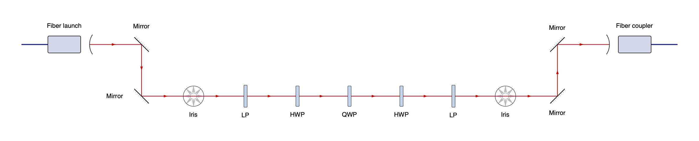
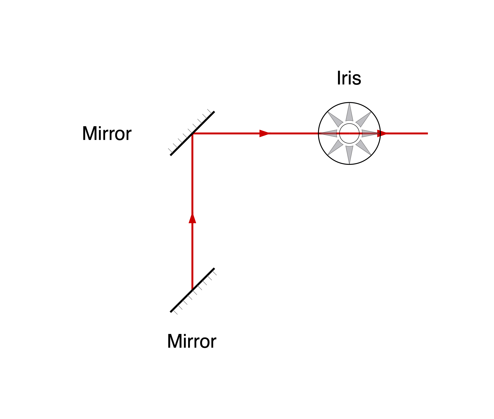
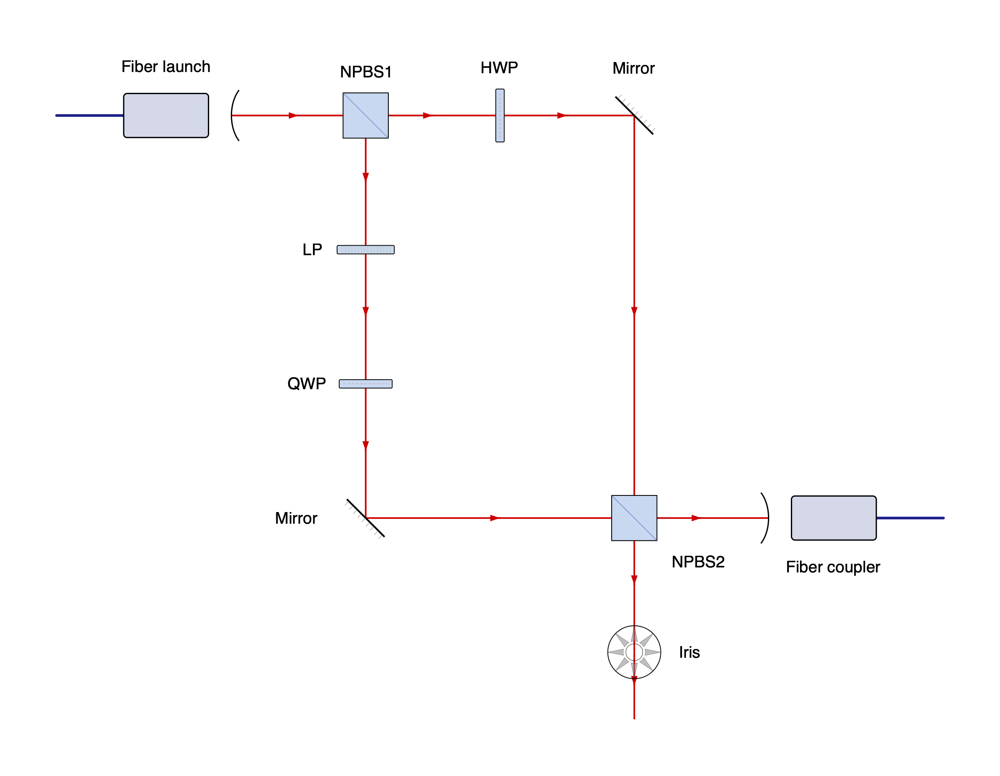
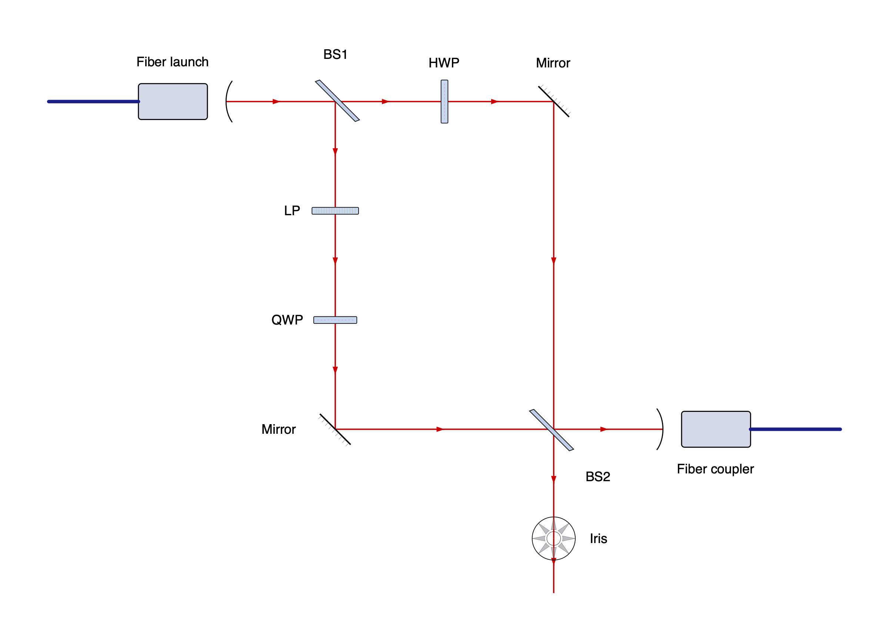
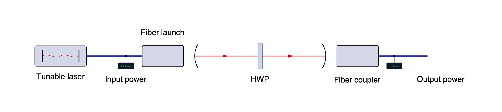
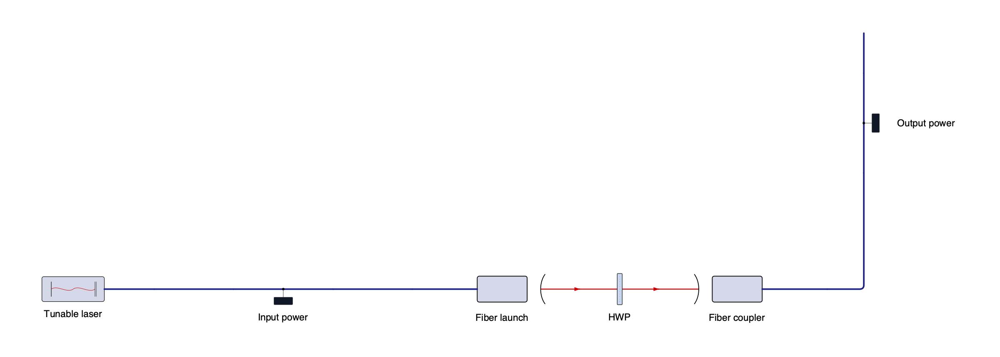
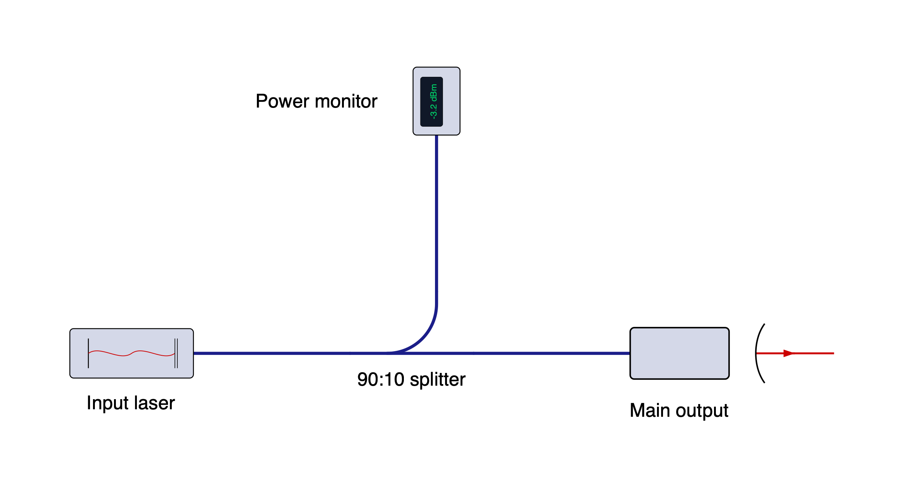
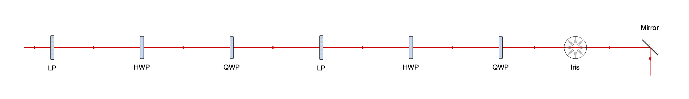
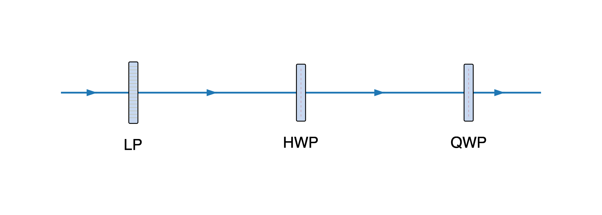

# beampath

A Python DSL for optical setup diagrams. Compose reusable component specifications
into a physical graph, solve its spacing, and render editable SVG artwork.

Start with a fiber launch, two mirrors, a half-wave plate, and a fiber coupler.
`>>` connects components in beam order:

<!-- README:BEGIN hello -->
```python
from beampath.components import *

setup = (
    fiber_launch()
    >> mirror(turn="right")
    >> HWP()
    >> mirror(turn="left")
    >> fiber_launch(role="couple")
)
setup.save("hello.svg")
```
<!-- README:END hello -->


Runnable example: [hello.py](examples/hello.py).

## Linear chains

<!-- README:BEGIN cage -->
```python
from beampath.components import *

setup = (
    fiber_launch()
    >> mirror(turn="right")
    >> mirror(turn="left")
    >> iris()
    >> LP()
    >> HWP()
    >> QWP()
    >> HWP()
    >> LP()
    >> iris()
    >> mirror(turn="left")
    >> mirror(turn="right")
    >> fiber_launch(role="couple")
)
setup.save("setup.svg")
```
<!-- README:END cage -->



Runnable example: [cage.py](examples/cage.py).

Chains start building to the east. Use `beam("west") >> fiber_launch(...)` for another direction,
or `beam(30)` for a numeric heading. Angles are degrees, clockwise positive:
east is 0, south 90, west 180, and north 270. An incoming beam stub is drawn
automatically when the first component has a free-space input, including in
shorthand chains such as `iris() >> HWP()`. A fiber launch starts at its output,
with no incoming free-space stub on its fiber side. A fiber coupler used first
receives an incoming stub. For a single component, write `beam() >> iris()`.

Mirror and beamsplitter `angle` arguments describe the surface normal relative
to the incoming beam: `mirror(angle=-45)` turns east to south. 

A mirror has more flexibility. It accepts
exactly one of `angle`, `heading`, or `turn`. `mirror(heading="north")` or
`mirror(heading=270)` sets the absolute outbound beam heading, using the same
clockwise degrees as `beam()`. `mirror(turn="left")` and `mirror(turn="right")`
turn the incoming beam by 90 degrees. Impossible reflections, such as an east
beam meeting `mirror(heading="east")`, raise `ComponentError` when connected;
a grazing `angle` raises it when the specification is created. 

<!-- README:BEGIN mirror_heading -->
```python
from beampath import beam
from beampath.components import *

setup = beam("east") >> mirror(heading="north") >> mirror(turn="right") >> iris()
setup.save("mirror_heading.svg")
```
<!-- README:END mirror_heading -->



Runnable example: [mirror_heading.py](examples/mirror_heading.py).

`LP`, `HWP`, and `QWP` denote a linear polarizer, half-wave plate, and
quarter-wave plate. Labels default to component names; `label=""` hides one.
Use `\n` for line breaks, such as `HWP("HWP\nIn Rotation Mount")`;
each line is center-aligned.
Waveplates display only their label, with no additional annotations.
`nd_filter()` and `bandpass_filter()` add straight-through free-space filters,
using PCL artwork. Their default labels are `ND filter` and `Bandpass filter`;
pass a custom label such as `nd_filter("ND 2.0")` or `bandpass_filter("980 nm")`.

```python
from beampath.components import *

setup = fiber_launch() >> nd_filter() >> bandpass_filter() >> fiber_launch(role="couple")
setup.save("filters.svg")
```

The non-polarizing cube beamsplitter defaults to the label `NPBS`.
`noise_eater()` adds a straight-through noise eater, drawn as a tall green
housing with no control leads. Its original schematic artwork represents a
Thorlabs NEL03A; use `noise_eater("NE")` for a shorter label.
A fiber launch's `role` controls its orientation; `role="couple"` ends the
free-space section and supplies a fiber output.

## Branching and shared optics

A Mach–Zehnder interferometer (MZI) with two arms and a shared recombining
beamsplitter:

<!-- README:BEGIN mzi -->
```python
from beampath.components import *

split = fiber_launch() >> beamsplitter("NPBS1", angle=-45)
a = split.straight() >> HWP() >> mirror(heading="south")
b = split.reflect() >> LP() >> QWP() >> mirror(heading="east")
combined = a.join(b, beamsplitter("NPBS2", angle=+45))
combined.reflect() >> fiber_launch(role="couple")
combined.straight() >> iris()
split.save("mzi.svg")
```
<!-- README:END mzi -->



Runnable example: [mzi.py](examples/mzi.py).

Each `Path` is a mutable cursor in one `Setup`. `path >> optic` and
`path >>= optic` both advance it; `alias = path` aliases that cursor. Selecting
an output makes a separate cursor. An output can be connected once; using an
old cursor at an occupied output raises `ConnectionError`.

A splitter requires output selection before appending another optic.
`.straight()` and `.reflect()` abbreviate `.out("straight")` and
`.out("reflect")`. The names are relative to its **primary** incident beam.
The second incoming beam must follow the primary beam's reflected direction.
Both incoming beams share the same two output ports and one physical optic.

`a.join(b, spec)` creates that optic, connects `a` to its default input and `b`
to its other input, and consumes both cursors. The returned cursor selects its
outbound paths. Saving any path saves its whole setup, including all branches.

The same MZI can connect a shared instance explicitly, in either input order:

<!-- README:BEGIN shared_optic -->
```python
from beampath.components import *

split = fiber_launch() >> beamsplitter("NPBS1", angle=-45)
a = split.straight() >> HWP() >> mirror(heading="south")
b = split.reflect() >> LP() >> QWP() >> mirror(heading="east")
npbs2 = split.setup.add(beamsplitter("NPBS2", angle=+45))
b.connect(npbs2.input("secondary"))
a.connect(npbs2.input("primary"))
npbs2.reflect() >> fiber_launch(role="couple")
npbs2.straight() >> iris()
split.save("shared_optic.svg")
```
<!-- README:END shared_optic -->



Runnable example: [shared_optic.py](examples/shared_optic.py).

Here, `Setup.add()` creates the shared optic instead of `join()`.
`path.end` retrieves its current
`OpticRef`; the reference continues to identify that physical optic after the
cursor advances. Component specifications are reusable templates: inserting
the same specification twice creates two optics. Sharing requires an `OpticRef`.
Failed appends, connects, and joins leave the graph and cursors intact.

## Fiber and free-space paths

The same `>>` chain can pass through fiber and free-space optics. Ports specify
their medium, so connecting a fiber output directly to a free-space input raises
an error. `fiber_launch()` converts fiber to free-space;
`fiber_launch(role="couple")` converts back to fiber and allows the chain to continue.

<!-- README:BEGIN mixed_fiber -->
```python
from beampath.components import *

setup = (
    fiber_laser("Tunable laser")
    >> inline_power_meter("Input power")
    >> fiber_launch()
    >> HWP()
    >> fiber_launch(role="couple")
    >> inline_power_meter("Output power")
)
setup.save("mixed_fiber.svg")
```
<!-- README:END mixed_fiber -->



Runnable example: [mixed_fiber.py](examples/mixed_fiber.py).

Fiber components and connections have no optical heading. Layout chooses their
positions and drawing rotations, preferring straight runs. Inline components
can lie on horizontal or vertical runs; bends occur outside their artwork.
Fiber attaches directly at each device's connector or tap. The assets contain
no cable tails: unconnected fiber ports receive layout-generated stubs, and
connecting a port replaces its stub with routed fiber from that same attachment.
Open inputs have `source=None`; open outputs have `target=None`. These are open
connection endpoints, with no additional components in the semantic graph.
The laser has no input port and therefore gets no incoming stub.
Each new free-space section defaults east; `fiber_launch(heading="north")`
or a numeric heading overrides it. An explicit heading elsewhere in the same
free-space section also constrains the section. Fiber never transmits that
heading to the next section. The existing `beam("north") >> fiber_launch()`
form continues to work.

Use `at=` to pin a component and let the fiber router introduce the necessary
bends. Here the output monitor moves above the free-space section:

<!-- README:BEGIN fiber_bends -->
```python
from beampath.components import *

setup = (
    fiber_laser("Tunable laser")
    >> inline_power_meter("Input power")
    >> fiber_launch()
    >> HWP()
    >> fiber_launch(role="couple")
)
setup.append(inline_power_meter("Output power"), at=(1900, -400))
setup.save("fiber_bends.svg")
```
<!-- README:END fiber_bends -->



Runnable example: [fiber_bends.py](examples/fiber_bends.py).

Routing prefers fewer bends, then shorter routes, and avoids component artwork
and labels. Cartesian routes have rounded corners; non-cardinal free-space
interfaces receive short aligned cable leads. Placement is deterministic and
does not automatically wrap a long chain into rows or promise a globally optimal
arrangement. Hard pins that obstruct a connector or overlap artwork raise a
`LayoutError` identifying the affected connection or component.

`distance=` remains a free-space spacing constraint; using it on fiber raises
an error. Diagram fiber lengths do not represent physical cable lengths.
Branching and joining use the same `out()`, `connect()`, and `join()` operations
as other components. Crossing lines never imply a connection, and closed paths
remain unsupported.

`fiber_splitter()` adds one fiber input and two outputs: a straight-through
connection and a perpendicular branch. Use `.straight()` and `.turn()` (also
available as `.out("straight")` and `.out("turn")`) to select them. `turn="left"`
is the default; `turn="right"` puts the branch on the opposite side of the housing.
These directions describe the connector arrangement in the component's drawing
pose; fiber carries no optical heading. Include a ratio in the label when useful,
such as `"90:10 splitter"`; the diagram does not calculate optical power.
The housing is adapted from PCL's monitor splitter, with connections drawn by
layout at the left, right and top or bottom edges.

<!-- README:BEGIN fiber_splitter -->
```python
from beampath.components import *

split = fiber_laser("Input laser") >> fiber_splitter("90:10 splitter", turn="left")
split.straight() >> fiber_launch("Main output")
split.turn() >> inline_power_meter("Power monitor")
split.save("fiber_splitter.svg")
```
<!-- README:END fiber_splitter -->



Runnable example: [fiber_splitter.py](examples/fiber_splitter.py).

`layout.fibers` contains one immutable `FiberRoute` per connection or open stub,
with `points`, `legs`, `length`, and source/target port references. Bend points
exist only in layout; `setup.connections` retains the original semantic edges.
`layout.segments` continues to contain straight free-space beams.
`PlacedOptic.rotation` is the drawing pose; the underlying instance's `heading`
is `None` for fiber-only components. `Style.fiber_color`, `fiber_width`, and
`fiber_radius` control generated cables; radius zero gives square corners.

## Spacing and reuse

The graph fixes beam headings; Kiwi solves positions and gap lengths.
Automatic free-space gaps are at least 190 diagram units, or the artwork
clearance if larger. They stretch to close joins, with equal gaps preferred along
straight runs. Fiber placement uses the same preferred 190-unit component pitch,
enlarging it for artwork or turn clearance; housing-edge ports do not add their
offsets to this spacing. Beam crossings do not create connections.
Initial free-space inputs, unconnected fiber inputs, and open outputs get short
stubs, controlled by `Style.open_length` (95 diagram units by default) and
extended as needed for artwork clearance.

<!-- README:BEGIN reuse -->
```python
from beampath import beam, chain
from beampath.components import *

polarization = chain(LP(), HWP(), QWP())
path = beam() >> polarization >> polarization  # Six independent optics.
path.append(iris(), distance=250)
path.append(mirror(turn="right"), at=(2000, 0))
path.save("reuse.svg")
```
<!-- README:END reuse -->



Runnable example: [reuse.py](examples/reuse.py).

`distance` fixes the incoming segment's length between its two port anchors;
it may be below the default pitch if artwork still clears. `at` fixes an
optic's reference point. Both hints are required constraints, and incompatible
hints raise `LayoutError`. For a chain, hints apply to its first component.
The initial beam origin locates the first optic, rather than its incoming
stub's open end. The first component's `at` overrides that origin. Named port
positions may differ from the optic's reference point.

`Setup.add(spec, at=...)` and `path.connect(input_ref, distance=...)` accept
the same constraints. For multiple initial beams, use `drawing = Setup()` and
`drawing.beam(direction, origin=(x, y))`; separate `beam()` calls create
separate setups and cannot be joined.

## Rendering

Use `Style` to control spacing, label size, and beam appearance:

<!-- README:BEGIN rendering -->
```python
from beampath import Style, beam
from beampath.components import *

STYLE = Style(pitch=220, font_size=20, beam_color="#1f77b4")

path = beam() >> LP() >> HWP() >> QWP()

layout = path.layout(style=STYLE)
svg_text = path.to_svg(style=STYLE)
path.save("rendering.png", style=STYLE, width=2400, dpi=600)
```
<!-- README:END rendering -->



Runnable example: [rendering.py](examples/rendering.py).

`Layout` is an immutable snapshot with `placements`, `segments`, `labels`, and
canvas `bounds`.
Editing the setup afterward does not change the snapshot.
Incoming stubs have `source=None` and `output=None`, with the actual `target`
and `input`; outgoing stubs have `target=None` and `input=None`. Segments with
both endpoints describe component-to-component connections. Stubs add no optics
or connections to the setup graph.
SVG export has no raster dependency. PNG export retains credits in a PNG text
chunk and embeds the requested resolution. The optional CairoSVG converter
requires native Cairo. On macOS with Homebrew, if the loader cannot find it,
set the library search path and launch Python directly:

```sh
brew install cairo
export DYLD_FALLBACK_LIBRARY_PATH="$(brew --prefix cairo)/lib${DYLD_FALLBACK_LIBRARY_PATH:+:$DYLD_FALLBACK_LIBRARY_PATH}"
.venv/bin/python your_script.py
```

Running `./your_script.py` with a `#!/usr/bin/env python` shebang goes through
the macOS-protected `/usr/bin/env` executable, which strips `DYLD_` environment
variables before Python starts. Launching the virtual environment's interpreter
directly preserves the search path. See Apple's
[runtime protections documentation](https://developer.apple.com/library/archive/documentation/Security/Conceptual/System_Integrity_Protection_Guide/RuntimeProtections/RuntimeProtections.html).

## Adding components

Definitions provide artwork, geometry, and ports. Input headings describe
propagation **into** the optic; output headings describe propagation **out**.
Free-space port directions and positions are relative to its reference beam frame, with
positions in diagram units. Artwork coordinates and bounds are in source SVG
units; the renderer applies its `scale`, reference `center`, and resolved pose.

Custom fiber ports use `Port("in", "input", medium="fiber")` and
`Port("out", "output", medium="fiber")`. Their optical `direction` is `None`.
Set `position` to the artwork's cable attachment in diagram units and optionally
set `exit_direction` to its outward drawing tangent (defaults: input west,
output east). Layout rotates the attachment and tangent together with the
component. `draw_open=False` suppresses an output stub and `draw_lead_in=False`
suppresses an input stub. Builtin fiber components generate both through layout.
Existing ports default to `medium="free_space"`.

<!-- README:BEGIN custom_component -->
```python
from beampath import (
    Artwork, ComponentDefinition, Geometry, Port,
    beam, component, register_component,
)
from beampath.components import *

def fork_geometry(parameters):
    return Geometry((
        Port("in", "input", 0, (-10, 0)),
        Port("forward", "output", 0, (10, 0)),
        Port("up", "output", 270, (0, -10)),
        Port("down", "output", 90, (0, 10)),
    ))


register_component(ComponentDefinition(
    name="fork",
    default_label="Fork",
    artwork=Artwork(
        center=(0, 0), bounds=(-10, -10, 10, 10),
        svg='<svg xmlns="http://www.w3.org/2000/svg">'
            '<rect x="-10" y="-10" width="20" height="20" fill="#d5d8e8"/>'
            '</svg>',
        attribution="beampath custom component example artwork",
    ),
    resolve=fork_geometry,
))

fork = beam() >> component("fork")
fork.out("forward") >> LP()
fork.out("up") >> HWP()
fork.out("down") >> QWP()
fork.save("custom_component.svg")
```
<!-- README:END custom_component -->


Runnable example: [custom_component.py](examples/custom_component.py).

Resolvers are pure functions of immutable parameters and return `Geometry`.
They may vary port directions, positions, and artwork rotation or reflection.
An output port with `absolute=True` fixes its direction in the drawing's
compass frame. An optional `resolve_incidence(parameters, heading)` on the
definition can refine local geometry and artwork once incidence is known;
it must preserve port names, kinds, and input directions. Resolved instance
geometry is available as `optic_ref.instance.geometry`; specifications stay
reusable even when their artwork depends on incidence.
Set `default_input` on the definition when its input is named differently;
mark optional inputs with `required=False`. Source definitions without inputs
use `default_input=None` and receive no incoming stub. Inputs draw a lead-in
when they start a beam; set `Port.draw_lead_in=False` for inputs such as a
source's fiber input where an incoming free-space beam should not be drawn.
Bounds should conservatively contain retained artwork,
including strokes and intrinsic text. A selector may remove captions or demo
elements from source SVGs. SVG IDs and local references are namespaced per
instance. Supply intrinsic text as ordinary positioned SVG text; placement
keeps it upright (pre-transformed or nested rotated text should be normalized
in custom artwork).

## Install

```sh
pip install 'beampath @ git+https://github.com/paul-gauthier/beampath.git'
# PNG export (also requires the native Cairo library):
pip install 'beampath[png] @ git+https://github.com/paul-gauthier/beampath.git'
```

Python 3.11 or later is required. PCL component artwork is credited to the
Photonics Component Library under CC BY 4.0; the noise-eater artwork is an
original beampath schematic. Credits and source hashes travel with exported SVGs.

## Development and examples

```sh
uv sync --extra dev --extra png
uv run python -m pytest
uv run python examples/hello.py --png
uv run python -m beampath.examples --diagram all --png
.venv/bin/python scripts/rebuild_readme.py
uv build
```

To refresh the README's code snippets and all eight PNG previews after editing
an example, run `.venv/bin/python scripts/rebuild_readme.py`. It works from any
directory when invoked by its path. PNG rendering needs the Cairo setup described
above; a rendering failure leaves the README and existing previews intact.

Edit the code between `# README:BEGIN` and `# README:END` in each example.
Multiple regions are combined and dedented, excluding the example's function
wrapper and command-line code. The helper updates only the blocks between the
matching `<!-- README:BEGIN name -->` and `<!-- README:END name -->` comments.
README-only save calls live in `SAVE_CALLS` in the helper; edit surrounding prose
directly in the README.

Every diagram has its own runnable Python file in [examples/](examples/), with
README previews in `examples/images/`. Run any file as shown above, or use
`--diagram hello`, `cage`, `mirror_heading`, `mzi`, `shared_optic`, `reuse`,
`rendering`, `custom_component`, `mixed_fiber`, `fiber_bends`, or `fiber_splitter`
with the module command. Use `--diagram all` to render every example.

Generated examples go under `build/examples/`; use `--output-dir` to choose
another directory. Omit `--png` for SVG only, or set `--width` to choose the
PNG width (default 2400 pixels). The module command also works after installing
the package. Tests verify the example scripts, layout, bundled artwork hashes,
attribution, PNG pixels, and rendering from an installed wheel.

Component artwork, its license, and source provenance live in
`src/beampath/assets/` and ship with the package.

This version produces schematic diagrams with finite acyclic connections.
Repeated passes, closed cavities, and optical power or polarization simulation
are deferred. Supplied angles are preserved; incompatible geometry and
remaining artwork/label overlaps fail with a nearby optic or port identified.
