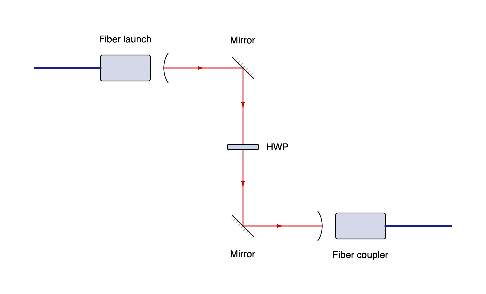
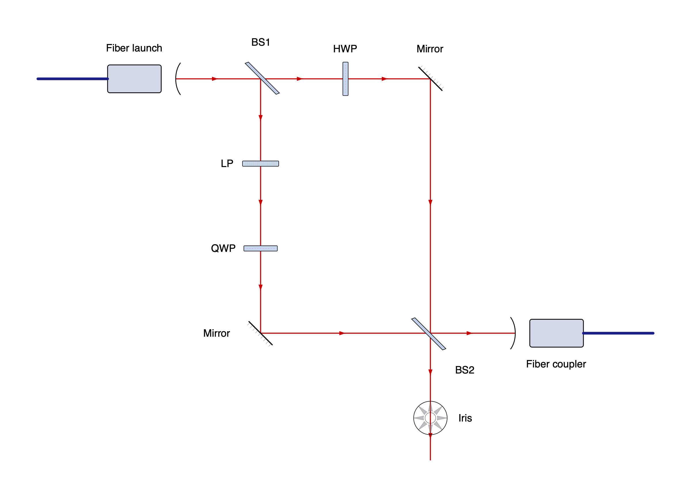

# beampath

A Python DSL for optical setup diagrams. Compose reusable component specifications
into a physical graph, solve its spacing, and render editable SVG artwork.

```sh
pip install 'beampath @ git+https://github.com/paul-gauthier/beampath.git'
# PNG export (also requires the native Cairo library):
pip install 'beampath[png] @ git+https://github.com/paul-gauthier/beampath.git'
```

Python 3.11 or later is required. Component artwork is credited to the Photonics
Component Library under CC BY 4.0; credits and source hashes travel with exported SVGs.

Start with a fiber launch, two mirrors, a half-wave plate, and a fiber coupler.
`>>` connects components in beam order:

```python
from beampath import *

setup = (
    fiber_launch()
    >> mirror(angle=-45)
    >> HWP()
    >> mirror(angle=+45)
    >> fiber_launch(role="couple")
)
setup.save("hello.svg")
```



## Linear chains

```python
setup = (
    fiber_launch()
    >> mirror(angle=-45)
    >> mirror(angle=+45)
    >> iris()
    >> LP()
    >> HWP()
    >> QWP()
    >> HWP()
    >> LP()
    >> iris()
    >> mirror(angle=+45)
    >> mirror(angle=-45)
    >> fiber_launch(role="couple")
)
setup.save("setup.svg")
```

Chains start building to the east. Use `beam("west") >> fiber_launch(...)` for another direction,
or `beam(30)` for a numeric heading. Angles are degrees, clockwise positive:
east is 0, south 90, west 180, and north 270. The initial beam draws no source
or leading gap. For a single component, write `beam() >> iris()`.

Mirror and beamsplitter `angle` arguments describe the surface normal relative
to the incoming beam. They are required: `mirror(angle=-45)` turns east to
south. `LP`, `HWP`, and `QWP` denote a linear polarizer, half-wave plate, and
quarter-wave plate. Labels default to component names; `label=""` hides one.
Waveplates display only their label, with no additional annotations.
A fiber launch's `role` controls its orientation; `role="couple"` ends the
free-space path.

## Branching and shared optics

A Mach–Zehnder interferometer (MZI) with two arms and a shared recombining
beamsplitter:

```python
split = (
    fiber_launch()
    >> beamsplitter("BS1", angle=-45)
)

a = split.straight() >> HWP() >> mirror(angle=-45)
b = split.reflect() >> LP() >> QWP() >> mirror(angle=+45)
combined = a.join(b, beamsplitter("BS2", angle=+45))

east = combined.reflect() >> fiber_launch(role="couple")
south = combined.straight() >> iris()
split.save("mzi.svg")
```



Each `Path` is a mutable cursor in one `Setup`. `path >> optic` and
`path >>= optic` both advance it; `alias = path` aliases that cursor. Selecting
an output makes a separate cursor. An output can be connected once; using an
old cursor at an occupied output raises `ConnectionError`.

A splitter requires output selection before appending another optic.
`.straight()` and `.reflect()` abbreviate `.out("straight")` and
`.out("reflect")`. The names are relative to its **primary** incident beam.
The second incoming beam must follow the primary beam's reflected direction.
Both incoming beams share the same two output ports and one physical optic.

`a.join(b, spec)` creates that optic, connects `a` to its default input and `b`
to its other input, and consumes both cursors. The returned cursor selects its
outbound paths. Saving any path saves its whole setup, including all branches.

You can also connect a shared instance explicitly, in either input order:

```python
bs2 = split.setup.add(beamsplitter("BS2", angle=+45))
b.connect(bs2.input("secondary"))
a.connect(bs2.input("primary"))
east = bs2.reflect()
```

Use this example in place of `join()`. `path.end` retrieves its current
`OpticRef`; the reference continues to identify that physical optic after the
cursor advances. Component specifications are reusable templates: inserting
the same specification twice creates two optics. Sharing requires an `OpticRef`.
Failed appends, connects, and joins leave the graph and cursors intact.

## Spacing and reuse

The graph fixes beam headings; Kiwi solves positions and gap lengths.
Automatic gaps are at least 190 diagram units, or the artwork clearance if
larger. They stretch to close joins, with equal gaps preferred along straight
runs. Beam crossings do not create connections. Open outputs get short stubs.

```python
polarization = chain(LP(), HWP(), QWP())
path = beam() >> polarization >> polarization  # Six independent optics.
path.append(iris(), distance=250)
path.append(mirror(angle=-45), at=(2000, 0))
```

`distance` fixes the incoming segment's length between its two port anchors;
it may be below the default pitch if artwork still clears. `at` fixes an
optic's reference point. Both hints are required constraints, and incompatible
hints raise `LayoutError`. For a chain, hints apply to its first component.
The first component's `at` overrides the initial beam origin. Named port
positions may differ from the optic's reference point.

`Setup.add(spec, at=...)` and `path.connect(input_ref, distance=...)` accept
the same constraints. For multiple initial beams, use `drawing = Setup()` and
`drawing.beam(direction, origin=(x, y))`; separate `beam()` calls create
separate setups and cannot be joined.

```python
layout = path.layout(style=Style(pitch=220, font_size=20))
svg_text = path.to_svg()
path.save("setup.png", width=2400, dpi=300)
```

`Layout` is an immutable snapshot with `placements`, `segments`, `labels`, and
canvas `bounds`.
Editing the setup afterward does not change the snapshot.
SVG export has no raster dependency. PNG export retains credits in a PNG text
chunk and embeds the requested resolution. The optional CairoSVG converter
requires native Cairo. On macOS with Homebrew, if the loader cannot find it:

```sh
brew install cairo
export DYLD_FALLBACK_LIBRARY_PATH="$(brew --prefix cairo)/lib${DYLD_FALLBACK_LIBRARY_PATH:+:$DYLD_FALLBACK_LIBRARY_PATH}"
```

## Adding components

Definitions provide artwork, geometry, and ports. Input headings describe
propagation **into** the optic; output headings describe propagation **out**.
Port directions and positions are relative to its reference beam frame, with
positions in diagram units. Artwork coordinates and bounds are in source SVG
units; the renderer applies its `scale`, reference `center`, and resolved pose.

```python
def fork_geometry(parameters):
    return Geometry((
        Port("in", "input", 0, (-10, 0)),
        Port("forward", "output", 0, (10, 0)),
        Port("up", "output", 270, (0, -10)),
        Port("down", "output", 90, (0, 10)),
    ))

register_component(ComponentDefinition(
    name="fork",
    default_label="Fork",
    artwork=Artwork(
        center=(0, 0), bounds=(-10, -10, 10, 10), path="fork.svg",
        attribution="Your artwork credit", license_url="Your license URL",
    ),
    resolve=fork_geometry,
))

fork = beam() >> component("fork")
fork.out("forward") >> LP()
fork.out("up") >> HWP()
fork.out("down") >> QWP()
```

Resolvers are pure functions of immutable parameters and return `Geometry`.
They may vary port directions, positions, and artwork rotation or reflection.
Set `default_input` on the definition when its input is named differently;
mark optional inputs with `required=False`. Source definitions without inputs
use `default_input=None`. Bounds should conservatively contain retained artwork,
including strokes and intrinsic text. A selector may remove captions or demo
elements from source SVGs. SVG IDs and local references are namespaced per
instance. Supply intrinsic text as ordinary positioned SVG text; placement
keeps it upright (pre-transformed or nested rotated text should be normalized
in custom artwork).

## Development and examples

```sh
uv sync --extra dev --extra png
uv run python -m pytest
uv run python -m beampath.examples --diagram mzi --png
uv run python -m beampath.examples --diagram cage --png
uv build
```

Generated examples go under `build/examples/`; use `--output-dir` to choose
another directory. Omit `--png` for SVG only, or set `--width` to choose the
PNG width (default 2400 pixels). The example command also works after installing
the package. Tests verify layout, bundled artwork hashes, attribution, PNG
pixels, and rendering from an installed wheel.

Component artwork, its license, and source provenance live in
`src/beampath/assets/` and ship with the package.

This version produces schematic diagrams with finite acyclic connections.
Repeated passes, closed cavities, and optical power or polarization simulation
are deferred. Supplied angles are preserved; incompatible geometry and
remaining artwork/label overlaps fail with a nearby optic or port identified.
