<!-- Generated by scripts/rebuild_docs.py; edit the Python sources. -->

# Components

[README](../README.md) · [Gallery](gallery.md) · [Components](components.md) · [API](api.md)

Import factories from `beampath.components` (also available from `beampath`).
The optional first argument is the label: `None` uses the default, `""` hides
it, and `\n` creates multiple lines. Each demo shows the component's open
beam or fiber ports.

[bandpass_filter](#bandpass_filter) · [beam_block](#beam_block) · [beamsplitter](#beamsplitter) · [detector](#detector) · [fiber_coupler](#fiber_coupler) · [fiber_laser](#fiber_laser) · [fiber_launch](#fiber_launch) · [fiber_power_meter](#fiber_power_meter) · [fiber_splitter](#fiber_splitter) · [HWP](#hwp) · [inline_power_meter](#inline_power_meter) · [iris](#iris) · [laser](#laser) · [LP](#lp) · [mirror](#mirror) · [nd_filter](#nd_filter) · [noise_eater](#noise_eater) · [PBS](#pbs) · [QWP](#qwp) · [spdc](#spdc) · [Custom components](#custom-components)

## bandpass_filter

```python
bandpass_filter(label=None)
```

A straight-through free-space bandpass filter.

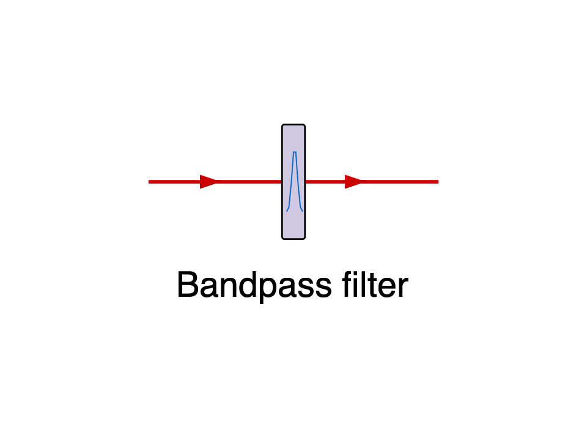

```python
from beampath import beam
from beampath.components import bandpass_filter

setup = beam() >> bandpass_filter()
```

[Source](../src/beampath/components/bandpass_filter.py)

## beam_block

```python
beam_block(label=None)
```

A beam block with one free-space input and no output, following incidence.

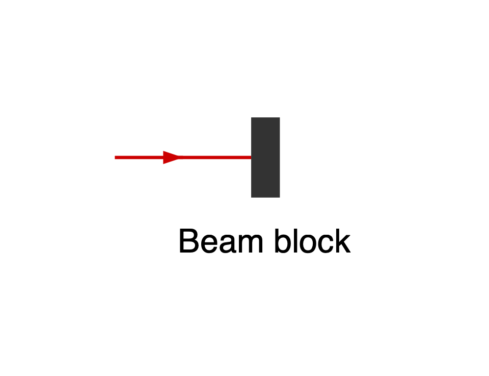

```python
from beampath import beam
from beampath.components import beam_block

setup = beam() >> beam_block()
```

[Source](../src/beampath/components/beam_block.py)

## beamsplitter

```python
beamsplitter(label=None, *, turn='left')
```

A non-polarizing cube beamsplitter, labeled NPBS by default.

turn selects a 90° reflection left (default) or right relative to the
primary incoming beam. Select outputs with straight() and reflect().

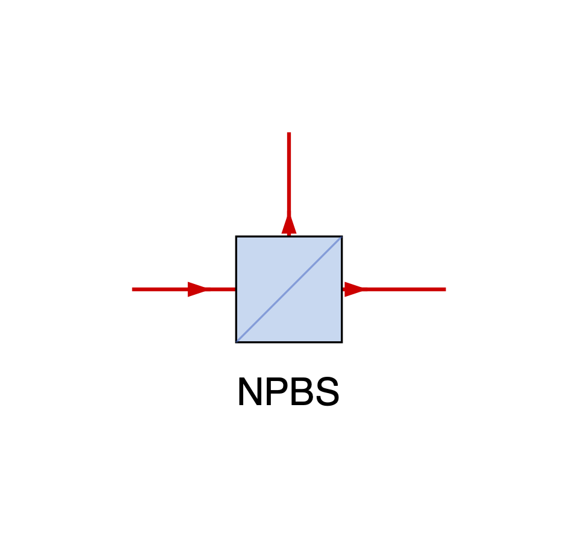

```python
from beampath import beam
from beampath.components import beamsplitter

setup = beam() >> beamsplitter()
```

[Source](../src/beampath/components/beamsplitter.py)

## detector

```python
detector(label=None)
```

A generic detector with one free-space input that ends the beam path.

The flat face follows the incoming beam. Detector type (such as a
single-photon detector) belongs in the label.

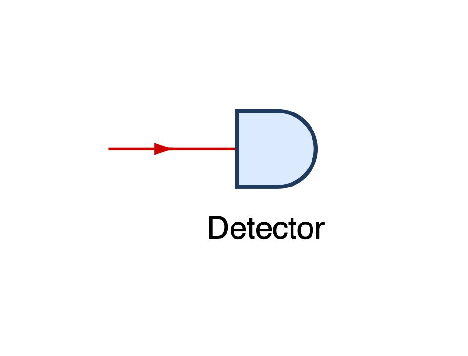

```python
from beampath import beam
from beampath.components import detector

setup = beam() >> detector()
```

[Source](../src/beampath/components/detector.py)

## fiber_coupler

```python
fiber_coupler(label=None, *, heading=None)
```

Convert free space to fiber, following the incoming beam heading.

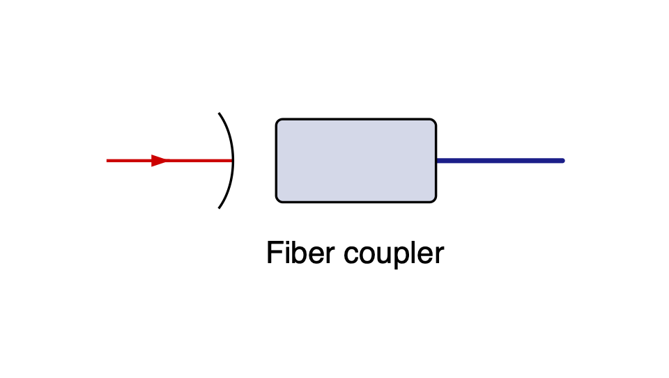

```python
from beampath import beam
from beampath.components import fiber_coupler

setup = beam() >> fiber_coupler()
```

[Source](../src/beampath/components/fiber_coupler.py)

## fiber_laser

```python
fiber_laser(label=None)
```

A source with a fiber output and no optical heading.

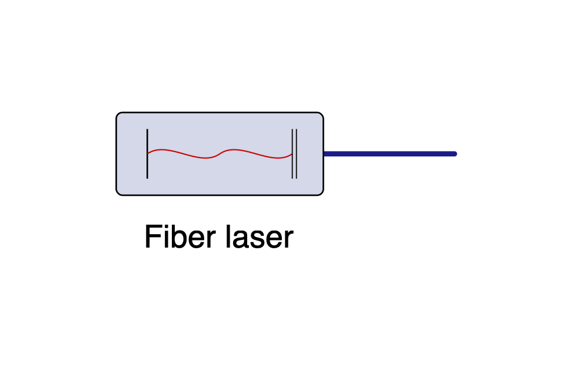

```python
from beampath import beam
from beampath.components import fiber_laser

setup = beam() >> fiber_laser()
```

[Source](../src/beampath/components/fiber_laser.py)

## fiber_launch

```python
fiber_launch(label=None, *, heading=None)
```

Convert fiber to free space, defaulting to an eastward beam heading.

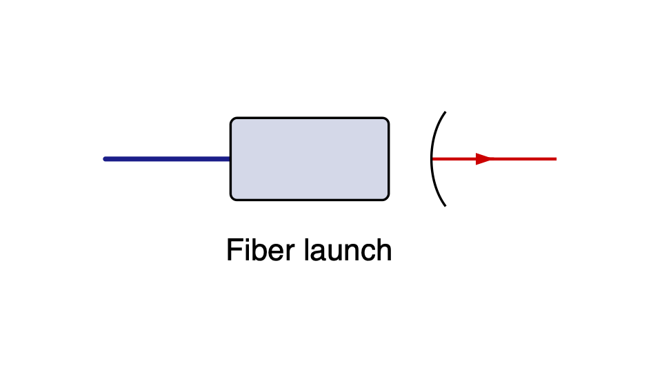

```python
from beampath import beam
from beampath.components import fiber_launch

setup = beam() >> fiber_launch()
```

[Source](../src/beampath/components/fiber_launch.py)

## fiber_power_meter

```python
fiber_power_meter(label=None)
```

A power meter with a single fiber input that ends the path.

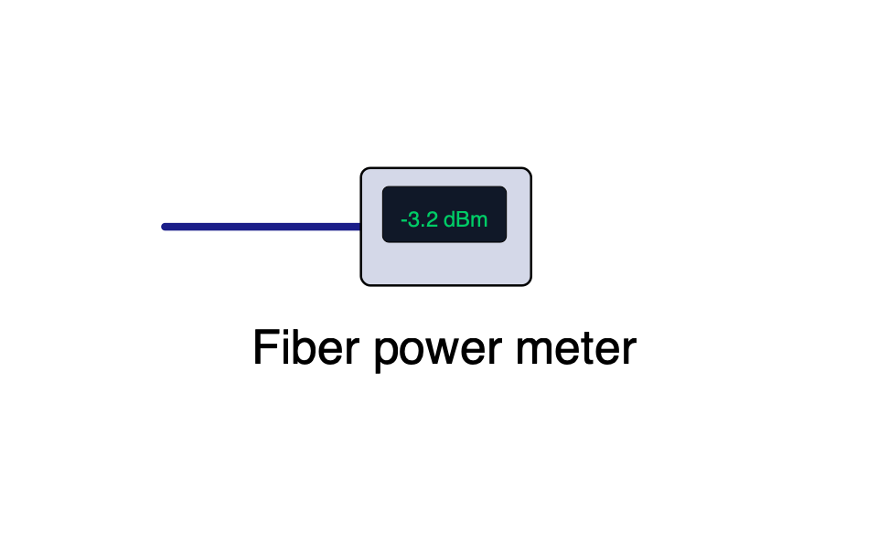

```python
from beampath import beam
from beampath.components import fiber_power_meter

setup = beam() >> fiber_power_meter()
```

[Source](../src/beampath/components/fiber_power_meter.py)

## fiber_splitter

```python
fiber_splitter(label=None, *, turn='left')
```

A continuous fiber with a curved branch ending at a perpendicular output.

turn selects the side of the branch relative to its drawing pose.
Select outputs with straight() and turn(), or out("straight"/"turn").
A split ratio can be included in the label.

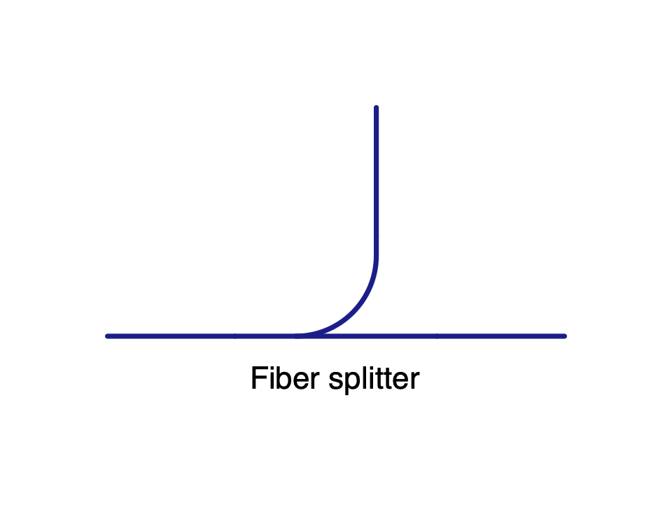

```python
from beampath import beam
from beampath.components import fiber_splitter

setup = beam() >> fiber_splitter()
```

[Source](../src/beampath/components/fiber_splitter.py)

## HWP

```python
HWP(label=None)
```

A straight-through half-wave plate, labeled HWP by default.

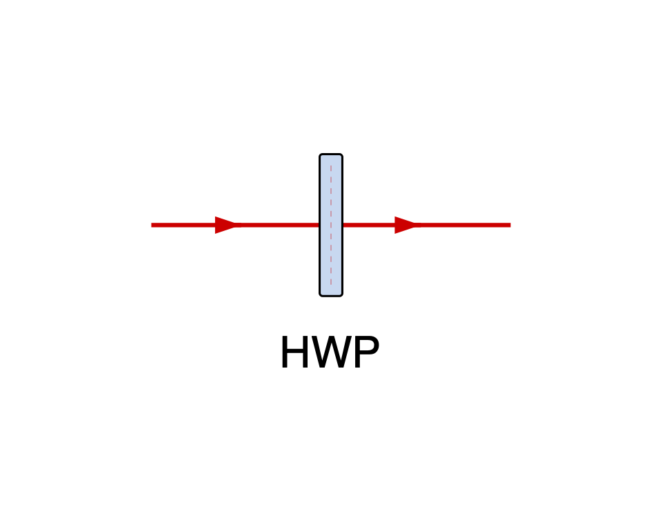

```python
from beampath import beam
from beampath.components import HWP

setup = beam() >> HWP()
```

[Source](../src/beampath/components/hwp.py)

## inline_power_meter

```python
inline_power_meter(label=None)
```

A power monitor through which the fiber path continues.

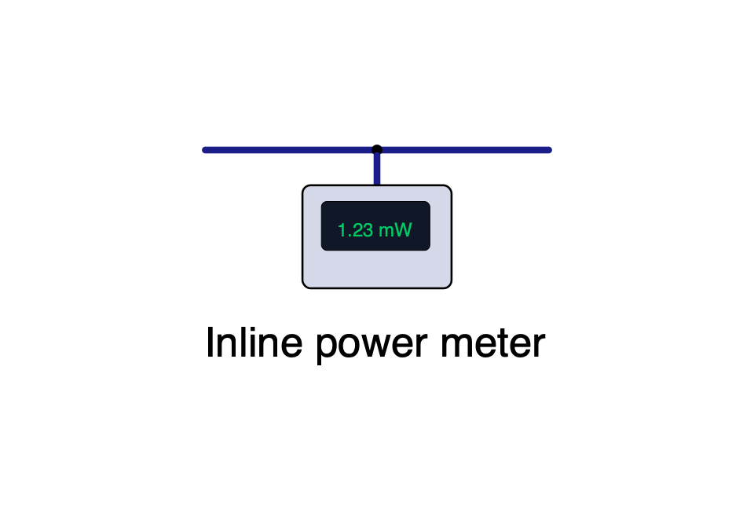

```python
from beampath import beam
from beampath.components import inline_power_meter

setup = beam() >> inline_power_meter()
```

[Source](../src/beampath/components/inline_power_meter.py)

## iris

```python
iris(label=None)
```

A straight-through free-space aperture.

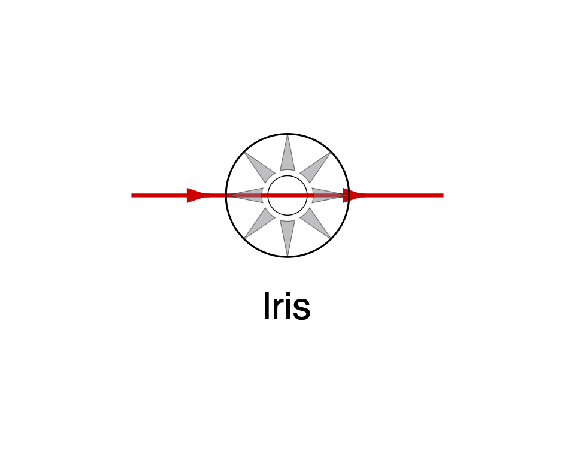

```python
from beampath import beam
from beampath.components import iris

setup = beam() >> iris()
```

[Source](../src/beampath/components/iris.py)

## laser

```python
laser(label=None)
```

A generic laser with one free-space output and no input.

The beam starts at the nozzle. Set its direction with beam(direction=...).
Laser type and wavelength belong in the label.

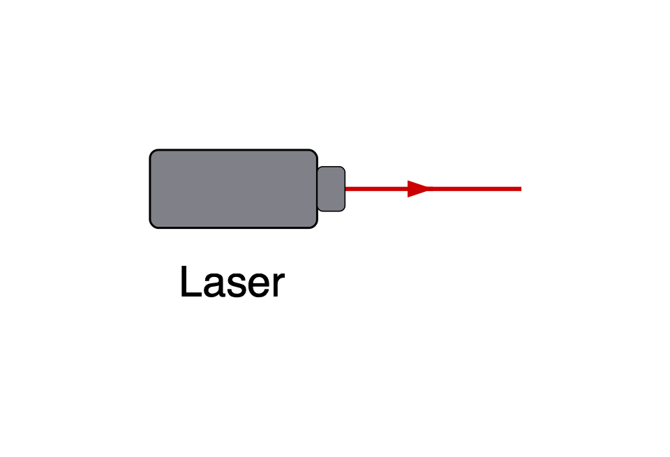

```python
from beampath import beam
from beampath.components import laser

setup = beam() >> laser()
```

[Source](../src/beampath/components/laser.py)

## LP

```python
LP(label=None)
```

A straight-through linear polarizer, labeled LP by default.

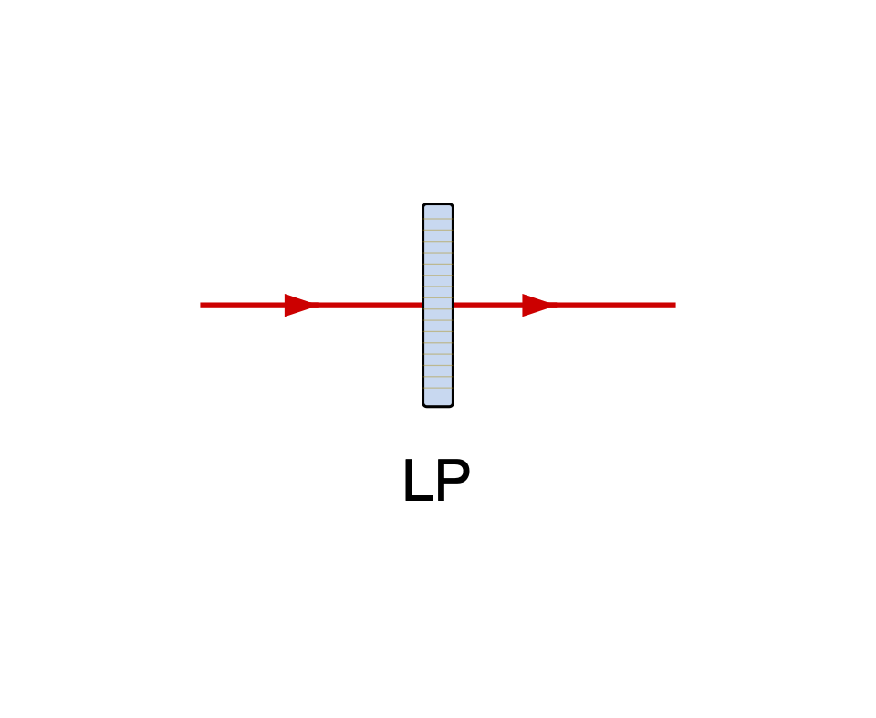

```python
from beampath import beam
from beampath.components import LP

setup = beam() >> LP()
```

[Source](../src/beampath/components/lp.py)

## mirror

```python
mirror(label=None, *, angle=None, heading=None, turn=None)
```

Reflect using exactly one of angle, heading, or turn.

heading sets the absolute outbound direction. turn is a relative 90-degree
left or right turn. angle sets the surface normal relative to incidence:
angle=-45 turns an eastward beam south. Grazing incidence is invalid.

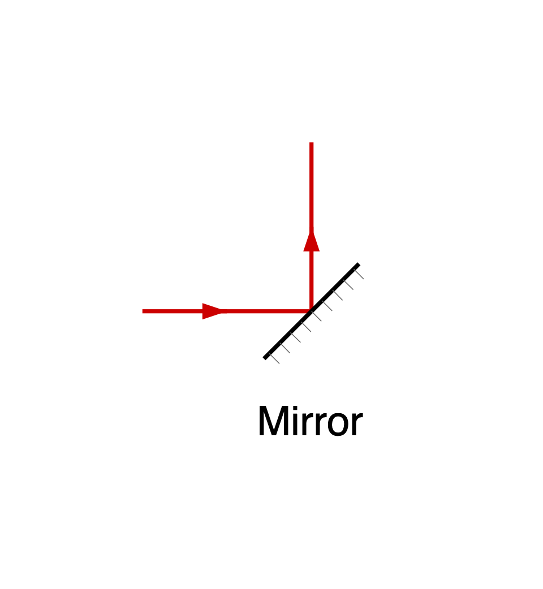

```python
from beampath import beam
from beampath.components import mirror

setup = beam() >> mirror(turn="left")
```

[Source](../src/beampath/components/mirror.py)

## nd_filter

```python
nd_filter(label=None)
```

A straight-through free-space neutral-density filter.

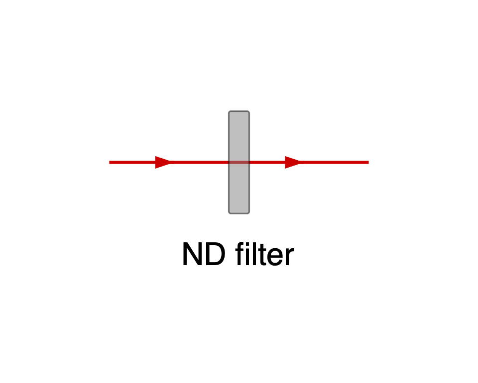

```python
from beampath import beam
from beampath.components import nd_filter

setup = beam() >> nd_filter()
```

[Source](../src/beampath/components/nd_filter.py)

## noise_eater

```python
noise_eater(label=None)
```

A straight-through NEL03A noise eater.

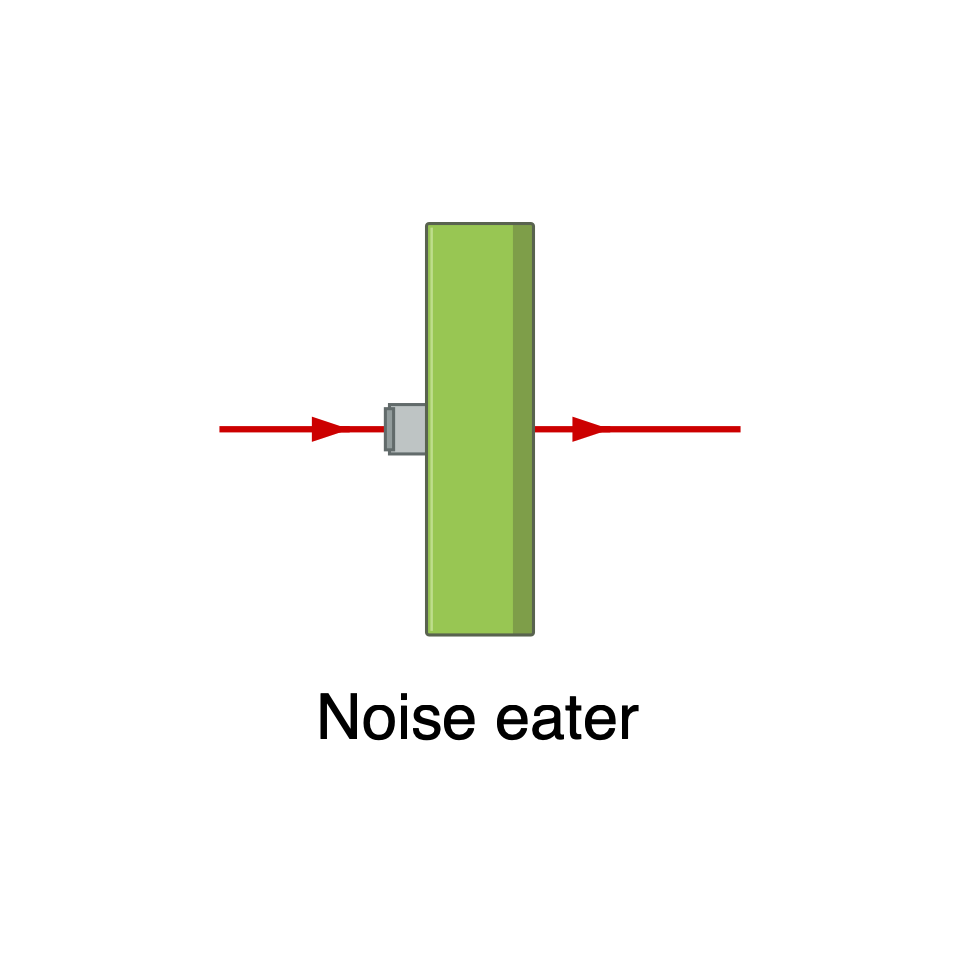

```python
from beampath import beam
from beampath.components import noise_eater

setup = beam() >> noise_eater()
```

[Source](../src/beampath/components/noise_eater.py)

## PBS

```python
PBS(label=None, *, turn='left')
```

A polarizing cube beamsplitter, labeled PBS by default.

The cube transmits p polarization and reflects s polarization. For the
primary input, straight() selects transmission and reflect() selects
the orthogonal output, 90° left (default) or right according to turn.
Inputs are "primary" (required and default) and "secondary" (optional).
Use join() or connect() to combine two incoming paths at one cube.

Output names describe geometry relative to primary incidence: for the
secondary input, transmission exits reflect and reflection exits straight.
They are not universal H/V labels when both inputs are occupied. Polarization
conventions are descriptive; beampath does not simulate polarization.

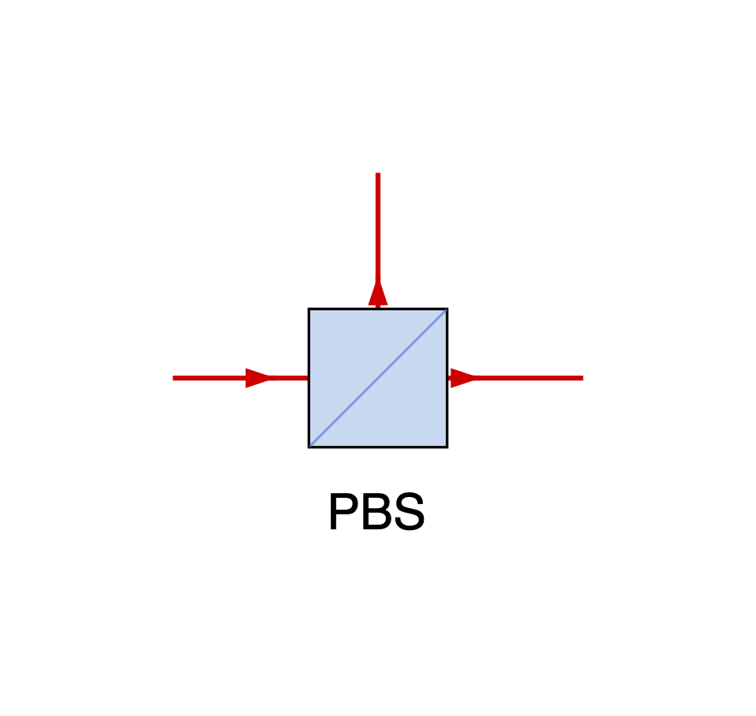

```python
from beampath import beam
from beampath.components import PBS

setup = beam() >> PBS()
```

[Source](../src/beampath/components/pbs.py)

## QWP

```python
QWP(label=None)
```

A straight-through quarter-wave plate, labeled QWP by default.

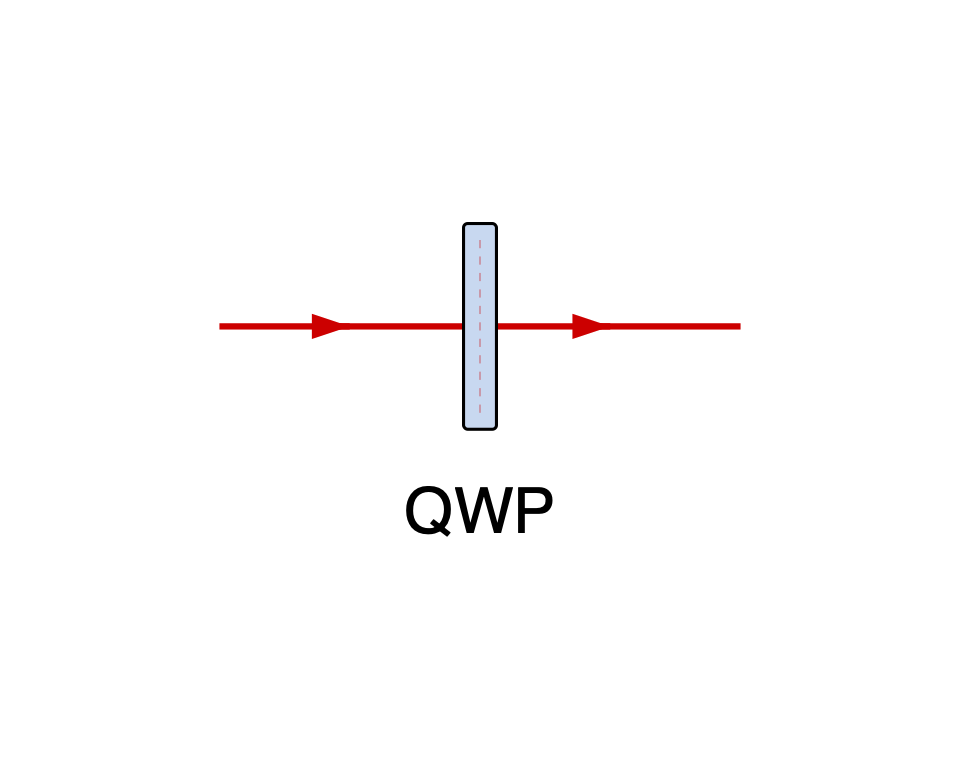

```python
from beampath import beam
from beampath.components import QWP

setup = beam() >> QWP()
```

[Source](../src/beampath/components/qwp.py)

## spdc

```python
spdc(label=None, *, opening_angle=20)
```

A generic SPDC crystal with pump, signal, and idler output ports.

opening_angle is the full signal-idler angle in degrees, from 0 to 180.
The pump continues straight; signal and idler turn by -/+ half the angle.
Zero makes all three outputs collinear, retaining their distinct names.
Select a path with out("pump"), out("signal"), or out("idler").
The default input "in" is the required pump. Optional "signal_in" and
"idler_in" inputs continue along their corresponding output rays; use
path.connect(crystal.input("idler_in")) to overlap an incoming idler.
Unconnected optional inputs are not drawn.
Crystal material and polarization type belong in the optional label.

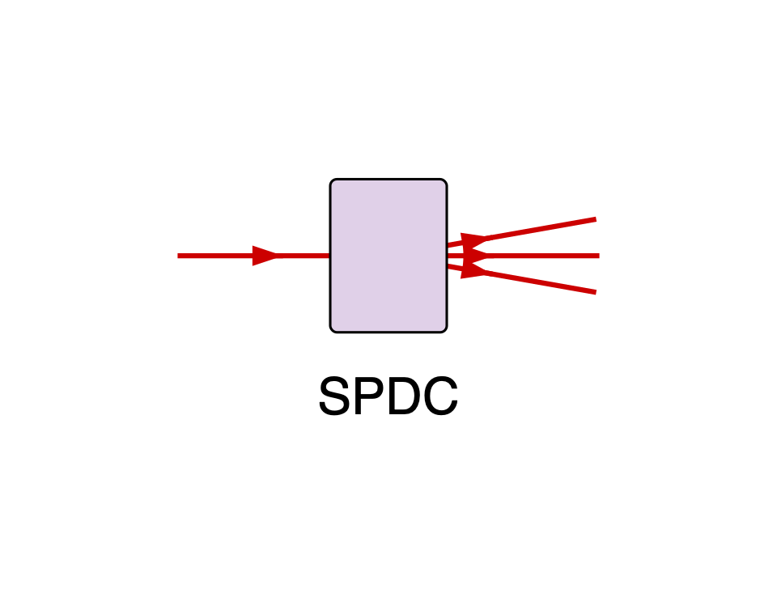

```python
from beampath import beam
from beampath.components import spdc

setup = beam() >> spdc()
```

[Source](../src/beampath/components/spdc.py)

## Custom components

To draw an optic beyond the builtins, combine `Artwork` and a `Geometry`
resolver in a `ComponentDefinition`, then wrap it in a reusable `ComponentSpec`.
Append the spec with `>>` and select its named outputs with `.out(name)`.

Define inline artwork and three named output ports for a custom component.


```python
from beampath import (
    Artwork, ComponentDefinition, ComponentSpec, Geometry, Port, beam,
)
from beampath.components import *


def fork_geometry(parameters):
    return Geometry((
        Port("in", "input", 0, (-10, 0)),
        Port("forward", "output", 0, (10, 0)),
        Port("up", "output", 270, (0, -10)),
        Port("down", "output", 90, (0, 10)),
    ))


fork_spec = ComponentSpec(ComponentDefinition(
    name="fork",
    default_label="Fork",
    artwork=Artwork(
        center=(0, 0), bounds=(-10, -10, 10, 10),
        svg='<svg xmlns="http://www.w3.org/2000/svg">'
            '<rect x="-10" y="-10" width="20" height="20" fill="#d5d8e8"/>'
            '</svg>',
        attribution="beampath custom component example artwork",
    ),
    resolve=fork_geometry,
))

setup = beam() >> fork_spec
setup.out("forward") >> LP()
setup.out("up") >> HWP()
setup.out("down") >> QWP()

setup.save("custom_component.svg")
```

[Source](../examples/custom_component.py)

Run this example with:

```sh
python -m beampath.examples --diagram custom_component --png
```

See the [geometry and artwork conventions](api.md#extending-and-inspecting)
and [component authoring guide](../src/beampath/components/README.md) for details.
