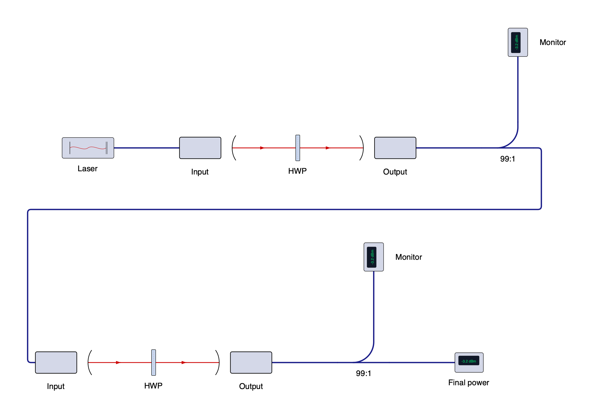
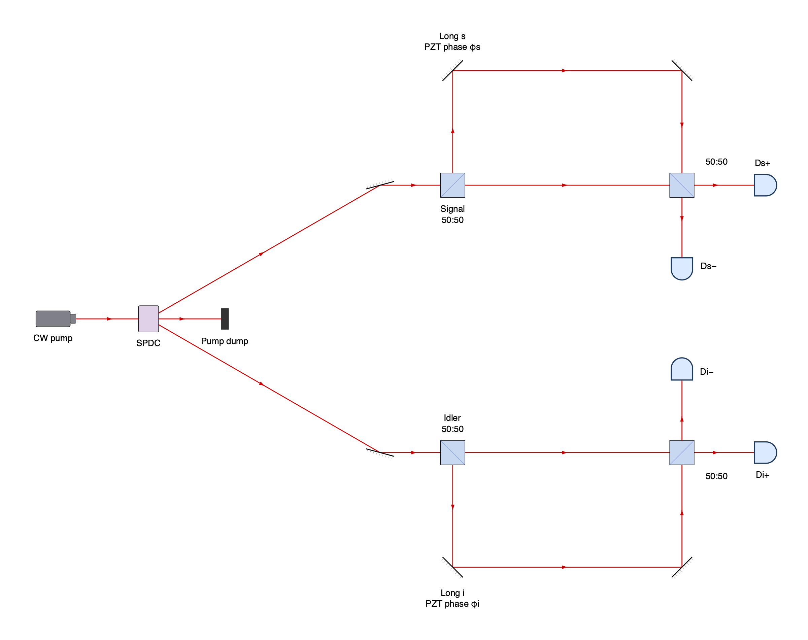
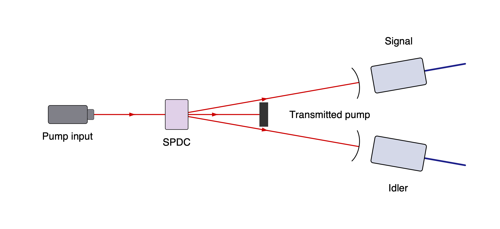
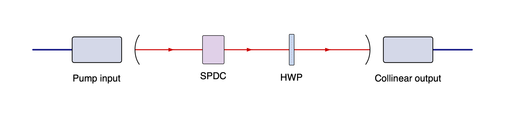
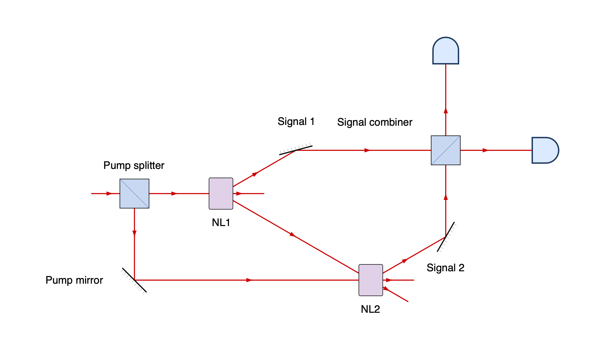

<!-- Generated by scripts/rebuild_docs.py; edit the Python sources. -->

# Examples

[README](../README.md) · [Gallery](gallery.md) · [Components](components.md) · [API](api.md)

Each file constructs a `setup`; the runner handles rendering. Copy a code block
and call `setup.save("diagram.svg")`, or run an example by its filename stem:

```sh
python -m beampath.examples --diagram hello --png
```

Outputs go to `build/examples/`. Use `--diagram all` for every example;
add `--pdf` for PDF. PNG/PDF need the [export dependencies](api.md#export).
When an example defines `style`, pass it to `setup.save(..., style=style)`.

[hello](#hello) · [cage](#cage) · [composition](#composition) · [custom_component](#custom_component) · [fiber_bends](#fiber_bends) · [fiber_splitter](#fiber_splitter) · [franson](#franson) · [mirror_heading](#mirror_heading) · [mixed_fiber](#mixed_fiber) · [mzi](#mzi) · [rendering](#rendering) · [reuse](#reuse) · [shared_optic](#shared_optic) · [spdc](#spdc) · [spdc_collinear](#spdc_collinear) · [zwm](#zwm)

## hello

A fiber path folded by two mirrors, with a half-wave plate.


```python
from beampath.components import *

setup = (
    fiber_launch()
    >> mirror(turn="right")
    >> HWP()
    >> mirror(turn="left")
    >> fiber_coupler()
)
```

[Source](../examples/hello.py)

## cage

A linear chain of polarization optics with folded fiber connections.


```python
from beampath.components import *

setup = (
    fiber_launch()
    >> mirror(turn="right")
    >> mirror(turn="left")
    >> iris()
    >> LP()
    >> HWP()
    >> QWP()
    >> HWP()
    >> LP()
    >> iris()
    >> mirror(turn="left")
    >> mirror(turn="right")
    >> fiber_coupler()
)
```

[Source](../examples/cage.py)

## composition

Build a reusable branched stage and connect two copies in stacked rows.



```python
from beampath import rows
from beampath.components import *


def build_stage():
    split = (
        fiber_launch("Input") >> HWP() >> fiber_coupler("Output")
        >> fiber_splitter("99:1", turn="left")
    )
    split.turn() >> fiber_power_meter("Monitor")
    return split.straight()


stage = build_stage()
cleanup = fiber_laser("Laser") >> stage
setup = rows(cleanup, stage)
setup >> fiber_power_meter("Final power")
```

[Source](../examples/composition.py)

## custom_component

Define inline artwork and three named output ports for a custom component.


```python
from beampath import (
    Artwork, ComponentDefinition, ComponentSpec, Geometry, Port, beam,
)
from beampath.components import *


def fork_geometry(parameters):
    return Geometry((
        Port("in", "input", 0, (-10, 0)),
        Port("forward", "output", 0, (10, 0)),
        Port("up", "output", 270, (0, -10)),
        Port("down", "output", 90, (0, 10)),
    ))


fork_spec = ComponentSpec(ComponentDefinition(
    name="fork",
    default_label="Fork",
    artwork=Artwork(
        center=(0, 0), bounds=(-10, -10, 10, 10),
        svg='<svg xmlns="http://www.w3.org/2000/svg">'
            '<rect x="-10" y="-10" width="20" height="20" fill="#d5d8e8"/>'
            '</svg>',
        attribution="beampath custom component example artwork",
    ),
    resolve=fork_geometry,
))

setup = beam() >> fork_spec
setup.out("forward") >> LP()
setup.out("up") >> HWP()
setup.out("down") >> QWP()
```

[Source](../examples/custom_component.py)

## fiber_bends

Pin a fiber monitor above a beam section and let the cable router connect it.


```python
from beampath.components import *

setup = (
    fiber_laser("Tunable laser")
    >> inline_power_meter("Input power")
    >> fiber_launch()
    >> HWP()
    >> fiber_coupler()
)
setup.append(inline_power_meter("Output power"), at=(1900, -400))
```

[Source](../examples/fiber_bends.py)

## fiber_splitter

A straight-through fiber output with a perpendicular power-monitor branch.


```python
from beampath.components import *

setup = fiber_laser("Input laser") >> fiber_splitter("90:10 splitter", turn="left")
setup.straight() >> fiber_launch("Main output")
setup.turn() >> fiber_power_meter("Power monitor")
```

[Source](../examples/fiber_splitter.py)

## franson

A Franson interferometer with SPDC and two matched unequal-arm analyzers.

The SPDC angle is exaggerated for readability; distances are schematic.



```python
from beampath.components import beam_block, beamsplitter, detector, fiber_launch, mirror, spdc

setup = fiber_launch("CW pump") >> spdc(opening_angle=60)
setup.out("pump") >> beam_block("Pump dump")

# Mirror the analyzers about the pump axis. The SPDC angle is exaggerated
# for clarity. Each straight short arm has length 600; its long arm adds
# two 300-unit legs, giving the same nonzero imbalance in both analyzers.
for channel, suffix, outward, inward, return_heading in (
    ("signal", "s", "left", "right", "south"),
    ("idler", "i", "right", "left", "north"),
):
    incoming = setup.out(channel).append(mirror("", heading="east"), distance=700)
    split = incoming >> beamsplitter(f"{channel.capitalize()}\n50:50", turn=outward)
    short = split.straight()
    long = split.reflect().append(mirror(f"Long {suffix}\nPZT phase φ{suffix}", heading="east"),
                                  distance=300)
    long.append(mirror("", heading=return_heading), distance=600)
    combined = short.join(long, beamsplitter("50:50", turn=inward))
    combined.straight() >> detector(f"D{suffix}+")
    combined.reflect() >> detector(f"D{suffix}−")
```

[Source](../examples/franson.py)

## mirror_heading

Set an absolute mirror heading, then make a relative 90-degree turn.


```python
from beampath import beam
from beampath.components import *

setup = beam("east") >> mirror(heading="north") >> mirror(turn="right") >> iris()
```

[Source](../examples/mirror_heading.py)

## mixed_fiber

A laser and inline power monitors surrounding a free-space waveplate.


```python
from beampath.components import *

setup = (
    fiber_laser("Tunable laser")
    >> inline_power_meter("Input power")
    >> fiber_launch()
    >> HWP()
    >> fiber_coupler()
    >> inline_power_meter("Output power")
)
```

[Source](../examples/mixed_fiber.py)

## mzi

A Mach–Zehnder interferometer with a shared recombining beamsplitter.


```python
from beampath.components import *

setup = fiber_launch() >> beamsplitter("NPBS1", turn="left")
lower = setup.straight() >> HWP() >> mirror(heading="north")
upper = setup.reflect() >> mirror(heading="east") >> HWP()
combined = lower.join(upper, beamsplitter("NPBS2", turn="right"))
combined.reflect() >> fiber_coupler()
combined.straight() >> fiber_coupler()
```

[Source](../examples/mzi.py)

## rendering

Render a polarization chain with custom spacing, labels, and beam color.


```python
from beampath import Style, beam
from beampath.components import *

style = Style(pitch=220, font_size=20, beam_color="#1f77b4")

setup = beam() >> LP() >> HWP() >> QWP()
```

[Source](../examples/rendering.py)

## reuse

Reuse a component chain and constrain its final gaps and position.


```python
from beampath import beam, chain

from beampath.components import *

polarization = chain(LP(), HWP(), QWP())
setup = beam() >> polarization >> polarization  # Six independent optics.
setup.append(iris(), distance=250)
setup.append(mirror(turn="right"), at=(2000, 0))
```

[Source](../examples/reuse.py)

## shared_optic

The MZI connected through named inputs on a shared physical optic.


```python
from beampath.components import *

setup = fiber_launch() >> beamsplitter("NPBS1", turn="right")
a = setup.straight() >> HWP() >> mirror(heading="south")
b = setup.reflect() >> LP() >> QWP() >> mirror(heading="east")
npbs2 = setup.setup.add(beamsplitter("NPBS2", turn="left"))
b.connect(npbs2.input("secondary"))
a.connect(npbs2.input("primary"))
npbs2.reflect() >> fiber_coupler()
npbs2.straight() >> iris()
```

[Source](../examples/shared_optic.py)

## spdc

A generic SPDC crystal with pump, signal, and idler branches.



```python
from beampath.components import *

setup = fiber_launch("Pump input") >> spdc()
# Small opening angles need longer paths to separate downstream optics.
setup.out("pump").append(iris("Transmitted pump"), distance=800)
setup.out("signal").append(fiber_coupler("Signal"), distance=500)
setup.out("idler").append(fiber_coupler("Idler"), distance=500)
```

[Source](../examples/spdc.py)

## spdc_collinear

Draw a collinear SPDC source and its common downstream optical path.



```python
from beampath.components import *

setup = fiber_launch("Pump input") >> spdc(opening_angle=0)
# Select one output to draw the common path through shared optics once.
setup.out("signal") >> HWP() >> fiber_coupler("Collinear output")
```

[Source](../examples/spdc_collinear.py)

## zwm

A Zou–Wang–Mandel setup with two SPDC crystals and overlapping idler paths.

The shared pump feeds both crystals; their signals meet at a beamsplitter.



```python
from beampath import beam
from beampath.components import beamsplitter, fiber_coupler, mirror, spdc

setup = beam() >> beamsplitter("Pump splitter", turn="right")
c1 = (setup.straight() >> spdc("NL1", opening_angle=60)).end
c2 = (
    setup.reflect()
    >> mirror("Pump mirror", heading="east")
    >> spdc("NL2", opening_angle=60)
).end

# The incoming idler continues along NL2's outgoing idler mode.
c1.out("idler").connect(c2.input("idler_in"))

s1 = c1.out("signal") >> mirror("Signal 1", heading="east")
s2 = c2.out("signal") >> mirror("Signal 2", heading="north")
combined = s1.join(s2, beamsplitter("Signal combiner", turn="left"))
combined.straight() >> fiber_coupler("Signal detection")
```

[Source](../examples/zwm.py)
