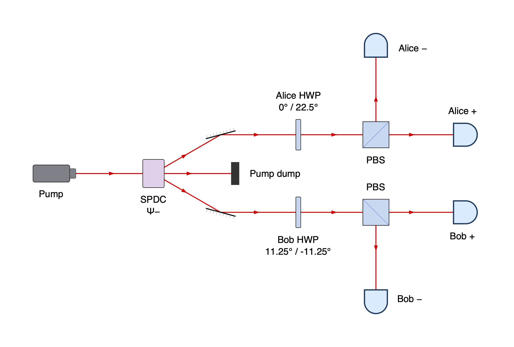
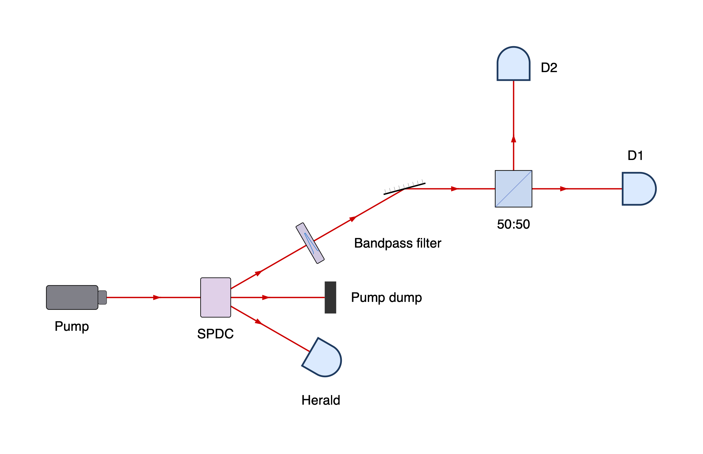
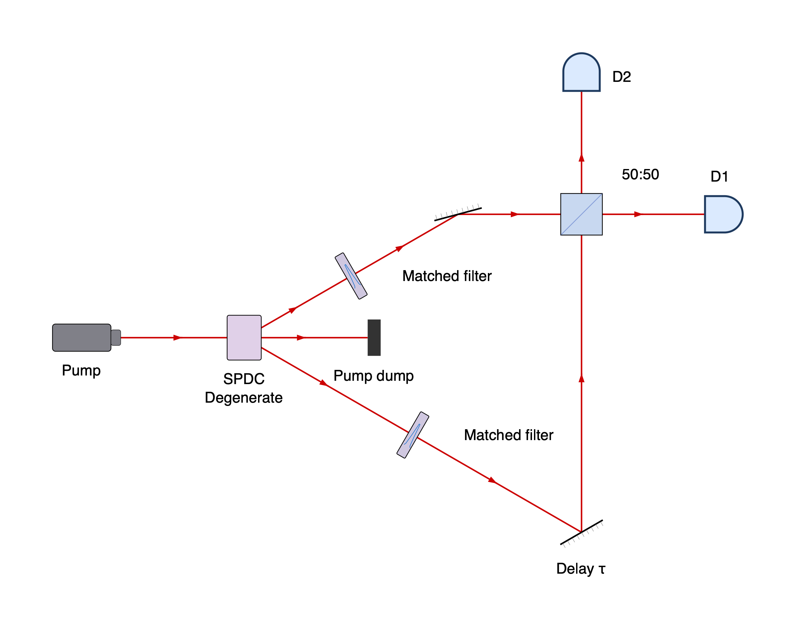
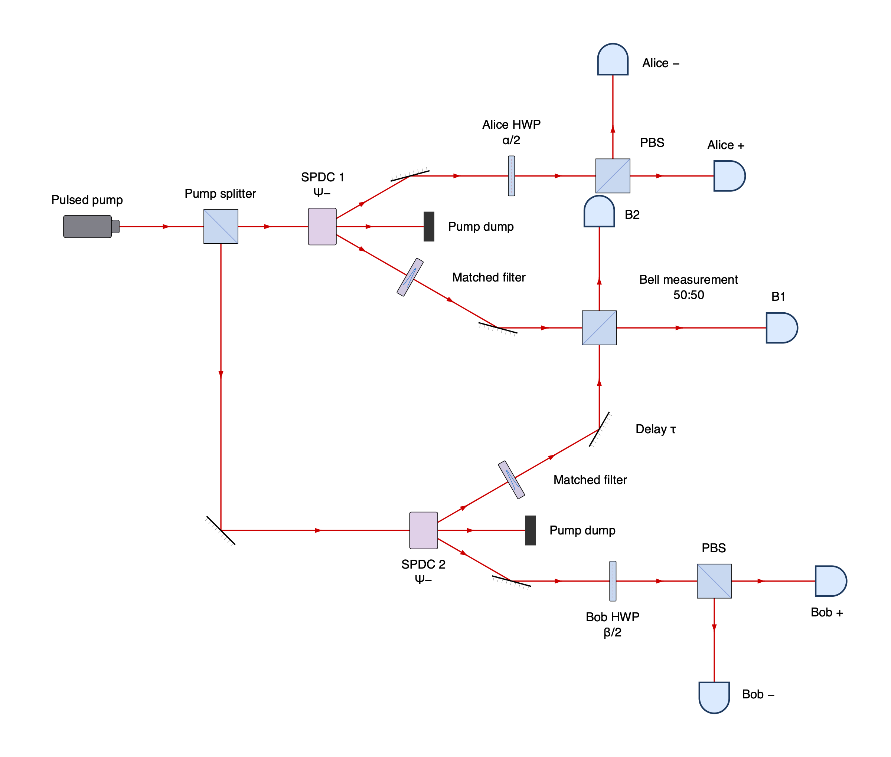

<!-- Generated by scripts/rebuild_docs.py; edit the Python sources. -->

# Examples

[README](../README.md) · [Gallery](gallery.md) · [Components](components.md) · [API](api.md)

Each code block constructs a `setup` and saves its diagram as an SVG.
Copy and run a code block, or run an example by its filename stem:

```sh
python -m beampath.examples --diagram hello --png
```

Outputs go to `build/examples/`. Use `--diagram all` for every example;
add `--pdf` for PDF. PNG/PDF need the [export dependencies](api.md#export).

[hello](#hello) · [cage](#cage) · [chsh](#chsh) · [fiber_splitter](#fiber_splitter) · [franson](#franson) · [ghz_path_identity](#ghz_path_identity) · [hbt](#hbt) · [hom](#hom) · [mirror_heading](#mirror_heading) · [mixed_fiber](#mixed_fiber) · [mzi](#mzi) · [rendering](#rendering) · [reuse](#reuse) · [spdc](#spdc) · [swapping](#swapping) · [zwm](#zwm)

## hello

A laser beam folded by two mirrors, with a half-wave plate and fiber output.


```python
from beampath.components import *

setup = (
    laser()
    >> mirror(turn="right")
    >> HWP()
    >> mirror(turn="left")
    >> fiber_coupler()
)

setup.save("hello.svg")
```

[Source](../examples/hello.py)

## cage

A laser-driven polarization chain with a folded path and fiber output.


```python
from beampath.components import *

setup = (
    laser()
    >> mirror(turn="right")
    >> mirror(turn="left")
    >> iris()
    >> LP()
    >> HWP()
    >> QWP()
    >> HWP()
    >> LP()
    >> iris()
    >> mirror(turn="left")
    >> mirror(turn="right")
    >> fiber_coupler()
)

setup.save("cage.svg")
```

[Source](../examples/cage.py)

## chsh

A CHSH Bell test with independently chosen Alice and Bob polarization analyzers.

The compact source represents compensated SPDC prepared in the singlet
|Ψ−⟩ = (|HV⟩ − |VH⟩) / √2; source preparation and collection optics are omitted.
Assume polarization-preserving routing and a PBS convention that transmits H
and reflects V in each analyzer's local basis. Each HWP at θ/2 selects the
linear-polarization measurement basis θ, with transmitted/reflected outcomes +/−.

Alice chooses a = 0° or a′ = 45°; Bob chooses b = 22.5° or b′ = −22.5°.
The slash-separated HWP labels are alternative settings, not simultaneous ones.
From coincidence counts, E = (N++ + N−− − N+− − N−+) / Ntotal. The ideal singlet
gives E(a,b) = −cos(2(a−b)) and |S| = 2√2 for
S = E(a,b) + E(a,b′) + E(a′,b) − E(a′,b′).

See [CHSH (1969)](https://doi.org/10.1103/PhysRevLett.23.880) and the entangled
source of [Kwiat et al. (1995)](https://doi.org/10.1103/PhysRevLett.75.4337).



```python
from beampath.components import HWP, PBS, beam_block, detector, laser, mirror, spdc


def analyzer(path, name, angles, *, turn):
    settings = " / ".join(f"{angle / 2:g}°" for angle in angles)
    split = path >> HWP(f"{name} HWP\n{settings}") >> PBS(turn=turn)
    split.straight() >> detector(f"{name} +")
    split.reflect() >> detector(f"{name} −")


alice_angles = (0, 45)
bob_angles = (22.5, -22.5)
setup = laser("Pump") >> spdc("SPDC\nΨ−", opening_angle=60)
setup.out("pump") >> beam_block("Pump dump")
alice = setup.out("signal") >> mirror("", heading="east")
bob = setup.out("idler") >> mirror("", heading="east")
analyzer(alice, "Alice", alice_angles, turn="left")
analyzer(bob, "Bob", bob_angles, turn="right")

setup.save("chsh.svg")
```

[Source](../examples/chsh.py)

## fiber_splitter

A straight-through fiber output with a perpendicular power-monitor branch.


```python
from beampath.components import *

setup = fiber_laser("Input laser") >> fiber_splitter("90:10 splitter", turn="left")
setup.straight() >> fiber_launch("Main output")
setup.turn() >> fiber_power_meter("Power monitor")

setup.save("fiber_splitter.svg")
```

[Source](../examples/fiber_splitter.py)

## franson

A Franson interferometer with SPDC and two matched unequal-arm analyzers.


```python
from beampath.components import beam_block, beamsplitter, detector, laser, mirror, spdc

setup = laser("CW pump") >> spdc(opening_angle=60)
setup.out("pump") >> beam_block("Pump dump")

# Mirror the analyzers about the pump axis. Each straight short arm has length
# 600; its long arm adds two 300-unit legs, giving the same nonzero imbalance
# in both analyzers.
for channel, suffix, outward, inward, return_heading in (
    ("signal", "s", "left", "right", "south"),
    ("idler", "i", "right", "left", "north"),
):
    incoming = setup.out(channel).append(mirror("", heading="east"), distance=700)
    split = incoming >> beamsplitter(f"{channel.capitalize()}\n50:50", turn=outward)
    short = split.straight()
    long = split.reflect().append(mirror(f"Long {suffix}\nPZT phase φ{suffix}", heading="east"),
                                  distance=300)
    long.append(mirror("", heading=return_heading), distance=600)
    combined = short.join(long, beamsplitter("50:50", turn=inward))
    combined.straight() >> detector(f"D{suffix}+")
    combined.reflect() >> detector(f"D{suffix}−")

setup.save("franson.svg")
```

[Source](../examples/franson.py)

## ghz_path_identity

Four-photon GHZ entanglement by path identity, using four degenerate SPDC sources.

The HH sources emit pairs into (a, b) and (c, d); the VV sources emit pairs
into (a, c) and (b, d). With coherent pumping, indistinguishable modes,
balanced pair amplitudes, and zero relative phase, postselecting one photon
in each output gives (|HHHH⟩ + |VVVV⟩) / √2 in the low-gain regime.
Pump waveplates rotate the polarization between the two source stages.

Based on the path-identity scheme in
[Fig. 1 of the PyTheus paper](https://arxiv.org/pdf/2210.09980#page=6).


```python
from beampath.components import HWP, beam_block, beamsplitter, detector, laser, mirror, spdc

setup = laser("Coherent pump") >> beamsplitter("Pump splitter", turn="right")

hh_ab = (
    setup.straight() >> spdc("SPDC\nHH", opening_angle=60)
).end
hh_cd = (
    setup.reflect() >> mirror("", heading="east") >> spdc("SPDC\nHH", opening_angle=60)
).end
vv_ac = (
    hh_ab.out("pump") >> HWP("Pump HWP\n45°") >> spdc("SPDC\nVV", opening_angle=60)
).end
vv_bd = (
    hh_cd.out("pump") >> HWP("Pump HWP\n45°") >> spdc("SPDC\nVV", opening_angle=60)
).end

# Each first-stage photon continues through a second-stage crystal in the
# same spatial mode as a possible VV photon. Crossings are not junctions.
a = hh_ab.out("signal") >> mirror("", heading=30)
a.connect(vv_ac.input("idler_in"))
hh_ab.out("idler").connect(vv_bd.input("idler_in"))
hh_cd.out("signal").connect(vv_ac.input("signal_in"))
d = hh_cd.out("idler") >> mirror("", heading=-30)
d.connect(vv_bd.input("signal_in"))

for crystal, outputs in ((vv_ac, ("c", "a")), (vv_bd, ("d", "b"))):
    crystal.out("pump") >> beam_block("Pump dump")
    for port, name in zip(("signal", "idler"), outputs):
        crystal.out(port) >> detector(name)

setup.save("ghz_path_identity.svg")
```

[Source](../examples/ghz_path_identity.py)

## hbt

A heralded Hanbury Brown–Twiss measurement of an SPDC single-photon source.

An idler click heralds its signal partner, which is split between D1 and D2.
Conditioning on the herald measures the signal's autocorrelation: in the
low-click-probability regime, `g_h^(2)(0) ≈ N_h N_h12 / (N_h1 N_h2)`, using herald
singles, herald–D1/D2 coincidences, and triple coincidences in consistent windows.
An ideal heralded single photon gives zero triple coincidences; multipair
emission and background can increase them. Coincidence processing is not drawn.

This SPDC version uses the heralded anticorrelation principle of
[Grangier, Roger, and Aspect (1986)](https://doi.org/10.1209/0295-5075/1/4/004).



```python
from beampath.components import bandpass_filter, beam_block, beamsplitter, detector, laser, mirror, spdc

setup = laser("Pump") >> spdc(opening_angle=60)
setup.out("pump") >> beam_block("Pump dump")
setup.out("idler") >> detector("Herald")

signal = setup.out("signal") >> bandpass_filter() >> mirror("", heading="east")
split = signal >> beamsplitter("50:50", turn="left")
split.straight() >> detector("D1")
split.reflect() >> detector("D2")

setup.save("hbt.svg")
```

[Source](../examples/hbt.py)

## hom

Hong–Ou–Mandel interference: two SPDC photons meet at one 50:50 beamsplitter.

Assume degenerate signal and idler photons with the same polarization, matched
spectral filters, and overlapping spatial modes at the beamsplitter. Scanning
the delay τ produces a dip in D1–D2 coincidences when the wavepackets overlap;
ideal indistinguishable photons leave together through either output.
The labeled delay represents a scanned path length, not a simulated time.

Based on [Hong, Ou, and Mandel (1987)](https://doi.org/10.1103/PhysRevLett.59.2044).



```python
from beampath.components import bandpass_filter, beam_block, beamsplitter, detector, laser, mirror, spdc

setup = laser("Pump") >> spdc("SPDC\nDegenerate", opening_angle=60)
setup.out("pump") >> beam_block("Pump dump")

signal = setup.out("signal") >> bandpass_filter("Matched filter") >> mirror("", heading="east")
idler = setup.out("idler") >> bandpass_filter("Matched filter") >> mirror("Delay τ", heading="north")
combined = signal.join(idler, beamsplitter("50:50", turn="left"))
combined.straight() >> detector("D1")
combined.reflect() >> detector("D2")

setup.save("hom.svg")
```

[Source](../examples/hom.py)

## mirror_heading

Set an absolute mirror heading, then make a relative 90-degree turn.


```python
from beampath import beam
from beampath.components import *

setup = beam("east") >> mirror(heading="north") >> mirror(turn="right") >> iris()

setup.save("mirror_heading.svg")
```

[Source](../examples/mirror_heading.py)

## mixed_fiber

A laser and inline power monitors surrounding a free-space waveplate.


```python
from beampath.components import *

setup = (
    fiber_laser("Tunable laser")
    >> inline_power_meter("Input power")
    >> fiber_launch()
    >> HWP()
    >> fiber_coupler()
    >> inline_power_meter("Output power")
)

setup.save("mixed_fiber.svg")
```

[Source](../examples/mixed_fiber.py)

## mzi

A Mach–Zehnder interferometer with a shared recombining beamsplitter.


```python
from beampath.components import *

setup = laser() >> beamsplitter("NPBS1", turn="left")
lower = setup.straight() >> HWP() >> mirror(heading="north")
upper = setup.reflect() >> mirror(heading="east") >> HWP()
combined = lower.join(upper, beamsplitter("NPBS2", turn="right"))
combined.reflect() >> detector()
combined.straight() >> detector()

setup.save("mzi.svg")
```

[Source](../examples/mzi.py)

## rendering

Render a polarization chain with custom spacing, labels, and beam color.


```python
from beampath import Style, beam
from beampath.components import *

style = Style(pitch=220, font_size=20, beam_color="#1f77b4")

setup = beam() >> LP() >> HWP() >> QWP()

setup.save("rendering.svg", style=style)
```

[Source](../examples/rendering.py)

## reuse

Reuse a component chain and constrain its final gaps and position.


```python
from beampath import beam, chain

from beampath.components import *

polarization = chain(LP(), HWP(), QWP())
setup = beam() >> polarization >> polarization  # Six independent optics.
setup.append(iris(), distance=250)
setup.append(mirror(turn="right"), at=(2000, 0))

setup.save("reuse.svg")
```

[Source](../examples/reuse.py)

## spdc

A generic SPDC crystal with pump, signal, and idler branches.


```python
from beampath.components import *

setup = laser("Pump input") >> spdc()
setup.out("pump") >> beam_block("Transmitted pump")
setup.out("signal") >> fiber_coupler("Signal")
setup.out("idler") >> fiber_coupler("Idler")

setup.save("spdc.svg")
```

[Source](../examples/spdc.py)

## swapping

Entanglement swapping with two singlet-pair sources and a partial Bell measurement.

Each compact source represents compensated SPDC preparing
|Ψ−⟩ = (|HV⟩ − |VH⟩) / √2; source preparation and collection optics are omitted.
A shared pulsed pump synchronizes the sources. One photon from each pair meets
at a 50:50 NPBS, with matched spectra, spatial modes, and arrival times; the
other photons go to Alice and Bob's HWP–PBS polarization analyzers.

In the one-pair-per-source sector, a B1–B2 coincidence selects the antisymmetric
singlet of the interfering photons and leaves the remote photons in a singlet.
This identifies one Bell state, not a complete Bell measurement. Fourfold events
(B1, B2, one Alice detector, one Bob detector) verify the swapped correlations;
higher-order SPDC emission and background are neglected. Routing preserves the
local H/V bases, and a HWP at θ/2 selects analyzer angle θ.

Based on [Pan et al. (1998)](https://doi.org/10.1103/PhysRevLett.80.3891).



```python
from beampath.components import HWP, PBS, bandpass_filter, beam_block, beamsplitter, detector, laser, mirror, spdc


def analyzer(path, name, angle, *, turn):
    split = path >> HWP(f"{name} HWP\n{angle}/2") >> PBS(turn=turn)
    split.straight() >> detector(f"{name} +")
    split.reflect() >> detector(f"{name} −")


setup = laser("Pulsed pump") >> beamsplitter("Pump splitter", turn="right")
pair1 = (setup.straight() >> spdc("SPDC 1\nΨ−", opening_angle=60)).end
pair2 = (
    setup.reflect() >> mirror("", heading="east") >> spdc("SPDC 2\nΨ−", opening_angle=60)
).end
for source in (pair1, pair2):
    source.out("pump") >> beam_block("Pump dump")

inner1 = pair1.out("idler") >> bandpass_filter("Matched filter") >> mirror("", heading="east")
inner2 = pair2.out("signal") >> bandpass_filter("Matched filter") >> mirror("Delay τ", heading="north")
bell = inner1.join(inner2, beamsplitter("Bell measurement\n50:50", turn="left"))
bell.straight() >> detector("B1")
bell.reflect() >> detector("B2")

alice = pair1.out("signal") >> mirror("", heading="east")
bob = pair2.out("idler") >> mirror("", heading="east")
analyzer(alice, "Alice", "α", turn="left")
analyzer(bob, "Bob", "β", turn="right")

setup.save("swapping.svg")
```

[Source](../examples/swapping.py)

## zwm

A Zou–Wang–Mandel setup with two SPDC crystals and overlapping idler paths.

The shared pump feeds both crystals; their signals meet at a beamsplitter.


```python
from beampath import beam
from beampath.components import *

setup = beam() >> beamsplitter("Pump splitter", turn="right")
c1 = (setup.straight() >> spdc("NL1", opening_angle=60)).end
c2 = (
    setup.reflect()
    >> mirror("Pump mirror", heading="east")
    >> spdc("NL2", opening_angle=60)
).end

# The incoming idler continues along NL2's outgoing idler mode.
c1.out("idler").connect(c2.input("idler_in"))

s1 = c1.out("signal") >> mirror("Signal 1", heading="east")
s2 = c2.out("signal") >> mirror("Signal 2", heading="north")
combined = s1.join(s2, beamsplitter("Signal combiner", turn="left"))
combined.straight() >> detector("")
combined.reflect() >> detector("")

setup.save("zwm.svg")
```

[Source](../examples/zwm.py)
