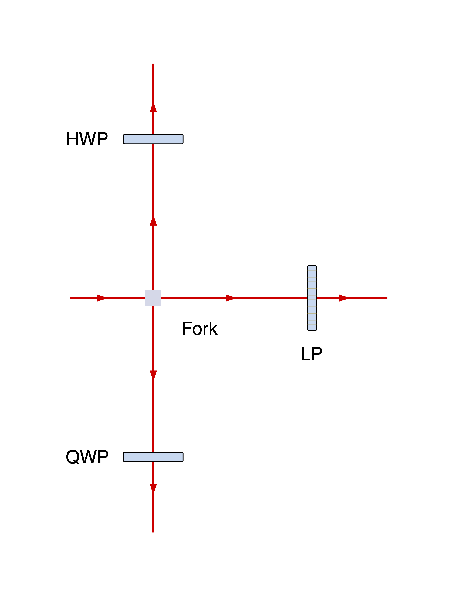

# Practical reference

[README](../README.md) · [User guide](guide.md) · [Development](development.md)

Contents: [Components](#builtin-components) · [Paths](#paths-and-shared-optics) ·
[Headings](#headings-and-angles) · [Spacing](#spacing-and-positioning) ·
[Rendering](#rendering) · [Inspection](#inspecting-layout) ·
[Custom components](#custom-components) · [Errors](#errors-and-limits)

## Builtin components

Import components from `beampath.components`; they are also exported from
`beampath`. Every factory accepts an optional first argument `label`.
`None` uses the default below, `""` hides it, and `\n` creates centered lines.

| Factory | Default label | Ports and options |
|---|---|---|
| `fiber_launch()` | Fiber launch | Fiber in → free space out; optional `heading`, defaults east for an unconstrained section |
| `fiber_coupler()` | Fiber coupler | Free space in → fiber out; follows incidence, optional `heading` constrains the section |
| `mirror()` | Mirror | Free space in/out; requires exactly one of `angle`, `heading`, or `turn` |
| `beamsplitter()` | NPBS | Free space inputs `primary` and optional `secondary`; outputs `straight` and `reflect`; `turn="left"` (default) or `"right"` |
| `iris()` | Iris | Straight-through free space |
| `LP()` | LP | Linear polarizer; straight-through free space |
| `HWP()` | HWP | Half-wave plate; straight-through free space |
| `QWP()` | QWP | Quarter-wave plate; straight-through free space |
| `nd_filter()` | ND filter | Neutral-density filter; straight-through free space |
| `bandpass_filter()` | Bandpass filter | Straight-through free space |
| `noise_eater()` | Noise eater | Straight-through free space |
| `fiber_laser()` | Fiber laser | Fiber output only |
| `inline_power_meter()` | Inline power meter | Fiber input and output |
| `fiber_power_meter()` | Fiber power meter | Fiber input only; ends a path |
| `fiber_splitter()` | Fiber splitter | Fiber input; `straight` and `turn` outputs; `turn="left"` (default) or `"right"` |

Except for the named splitter ports, inputs are `in` and outputs are `out`.
Fiber splitter turns describe connector arrangement in the drawing pose, not
optical headings. Put descriptive values in labels, such as
`nd_filter("ND 2.0")`, `bandpass_filter("980 nm")`, or
`fiber_splitter("90:10 splitter")`; these do not introduce simulation parameters.

## Paths and shared optics

Import `Setup`, `beam`, and `chain` from `beampath`.

| Operation | Effect |
|---|---|
| `beam(direction="east", origin=(0, 0))` | Start a path in a new setup |
| `drawing = Setup(); drawing.beam(...)` | Start paths belonging to the same setup |
| `path >> spec` / `path >>= spec` | Append a component or chain and advance the same cursor |
| `path.append(spec, distance=None, at=None)` | Append with spacing or position constraints; return the same cursor |
| `chain(*specs)` | Compose a reusable sequence of specifications |
| `path.out(name)` | Select an output with a separate cursor |
| `.straight()` / `.reflect()` / `.turn()` | Shorthand for the corresponding named output |
| `path.end` | Get a stable `OpticRef` for the current physical optic |
| `drawing.add(spec, at=None)` | Create an optic and return its `OpticRef` |
| `ref.input(name=None)` | Select an input; omission selects the definition's default |
| `path.connect(input_ref, distance=None)` | Connect to an existing optic, consume the cursor, and return that optic's reference |
| `a.join(b, spec, at=None)` | Create a shared two-input optic, consume both cursors, and return its output cursor |

A specification is a template; inserting it twice creates independent optics.
Use an `OpticRef` to share one physical instance. Its identity survives cursor
advancement, and `ref.out(name)` selects an outbound path. See
[shared_optic.py](../examples/shared_optic.py) for explicit connections.

`alias = path` aliases the same mutable cursor. Each port can be connected once;
stale cursors cannot reuse an occupied output. Choose an output before appending
to a splitter, and choose a new output after connecting or joining. Failed
appends, connections, and joins leave the graph and cursors intact.

Joined or connected paths must belong to the same setup. Separate `beam()` calls
create separate setups; use `Setup.beam()` for multiple roots in one diagram.
`join()` connects `a` to the default input and `b` to the other input. For a
beamsplitter, output names are relative to the **primary** incident beam; the
secondary incident beam must follow its reflected direction. Both inputs share
the same two output ports. Saving any path saves the whole setup.

## Headings and angles

Angles are degrees, clockwise positive: east = 0, south = 90, west = 180,
north = 270. Compass names and numeric headings work with `beam()` and the
`heading` options on mirrors and fiber transitions.

- `mirror(heading="north")` sets the absolute outbound heading.
- `mirror(turn="left")` or `mirror(turn="right")` turns 90° relative to incidence.
- `beamsplitter(turn="left")` (the default) or `beamsplitter(turn="right")`
  reflects one branch 90° relative to the primary incoming beam; the other
  continues straight. The cube faces stay aligned with the beam paths.
- Mirror `angle` specifies a surface normal relative to the
  incoming beam. For example, `mirror(angle=-45)` turns east to south.

A mirror cannot leave the beam heading unchanged. An impossible absolute
heading fails when connected; a grazing `angle` fails when the spec is created.

Fiber has no optical heading. Each new free-space section defaults east unless
constrained explicitly, for example by `fiber_launch(heading="north")` or
`beam("north") >> fiber_launch()`. Headings constrain the whole free-space
section but do not propagate through fiber to the next section.

## Spacing and positioning

All positions and distances use diagram units. Free-space headings are fixed;
layout solves positions and gap lengths. Automatic gaps are at least
`Style.pitch`, enlarged for artwork clearance, with equal gaps preferred along
straight runs and stretching where needed to close joins.

`distance=` fixes the incoming gap between port anchors. It must be positive and
can be below the default pitch if artwork clears. It is unavailable on the
first component or a fiber connection. `at=(x, y)` pins the optic's reference
point, which may differ from a port position. On a chain, both hints apply only
to its first component. They are required constraints; conflicts raise
`LayoutError`.

The beam `origin` places the first optic, not the open end of its incoming stub.
The first optic's `at` overrides that origin. `Setup.add()` accepts `at`;
`path.connect()` accepts `distance`.

Fiber placement prefers straight runs. Routing prefers fewer bends, then shorter
routes, avoiding artwork and labels. Pins remain fixed; layout may rotate fiber
devices to align their connectors. Fiber lengths are drawing lengths, not
physical cable lengths. Layout is deterministic but does not guarantee a global
optimum or wrap long chains into rows. Labels are placed after components and
do not expand component spacing.

Initial free-space inputs and open outputs receive stubs; unconnected fiber
ports receive routed stubs at their attachments. Connecting a port replaces its
stub. A laser has no input and gets no incoming stub; a launch's incoming stub
is fiber, while a coupler's is free space. `Style.open_length` sets their nominal
length, extended when needed for artwork clearance. Stubs and cable bends add
no optics or connections to the graph. Crossings never imply a connection.

## Rendering

`Path` and `Setup` both support `layout(style=...)`, `to_svg(style=...)`, and
`save(filename, style=..., width=None, dpi=96)`. `save()` returns the output path
and chooses the format from the case-insensitive filename suffix.

| Format | Installation | Sizing |
|---|---|---|
| `.svg` | Base package | Editable vectors and text; `width` is not accepted |
| `.png` | `png` extra and native Cairo | `width` sets pixel width, preserving aspect ratio; omitted uses canvas width; `dpi` is embedded as resolution |
| `.pdf` | `pdf` extra and native Cairo | Vector artwork and selectable text; `width` and `dpi` set physical page size |

To install both optional exporters from GitHub:

```sh
pip install 'beampath[png,pdf] @ git+https://github.com/paul-gauthier/beampath.git'
```

`width` must be a positive integer; `dpi` must be positive. PDF width is measured
in diagram pixels, converted to inches using `dpi`: `width=960, dpi=96` gives a
10-inch-wide page. Omit `width` to use the canvas width. PDF `dpi` controls page
size, not vector quality. All formats share the SVG canvas and margins.
Credits, source hashes, and the attribution manifest are retained in exports;
PNG and PDF store the manifest under `beampath-attribution` metadata.

### Style options

Pass `Style(...)` from `beampath`; see the
[rendering walkthrough](guide.md#styling-and-export).

| Option | Default | Controls |
|---|---|---|
| `pitch` | `190` | Minimum automatic gap between port anchors |
| `clearance` | `20` | Component/layout clearance |
| `margin` | `80` | Canvas margin |
| `font_size` | `23` | Label text size |
| `label_gap` | `14` | Label offset from artwork |
| `open_length` | `95` | Nominal open stub length |
| `beam_width` | `2.3` | Free-space line width |
| `beam_color` | `"#CC0000"` | Free-space line color |
| `font_family` | `"Helvetica, Arial, sans-serif"` | Label font stack |
| `background` | `"#FFFFFF"` | Canvas background |
| `fiber_color` | `"#1B1E89"` | Fiber line color |
| `fiber_width` | `3.75` | Fiber line width |
| `fiber_radius` | `10` | Rounded cable corners; zero gives square corners |

Numeric style options must be positive, except `fiber_radius`, which may be zero.

### Cairo troubleshooting

If PNG/PDF export reports a missing converter, install its extra. If native
Cairo cannot be loaded on macOS with Homebrew:

```sh
brew install cairo
export DYLD_FALLBACK_LIBRARY_PATH="$(brew --prefix cairo)/lib${DYLD_FALLBACK_LIBRARY_PATH:+:$DYLD_FALLBACK_LIBRARY_PATH}"
.venv/bin/python your_script.py
```

Launch the environment's Python directly. A `#!/usr/bin/env python` shebang goes
through a macOS-protected executable that strips `DYLD_` variables; see Apple's
[runtime protections documentation](https://developer.apple.com/library/archive/documentation/Security/Conceptual/System_Integrity_Protection_Guide/RuntimeProtections/RuntimeProtections.html).
SVG export does not need Cairo.

## Inspecting layout

`layout()` returns an immutable snapshot; later setup edits do not change it.

| Attribute | Contents |
|---|---|
| `placements` | Optic IDs mapped to `PlacedOptic` objects, with positions, bounds, and drawing rotations |
| `segments` | Straight free-space `Segment` objects |
| `fibers` | `FiberRoute` objects, one per fiber connection or open stub, with `points`, `legs`, and `length` |
| `labels` | Positioned upright label text and bounds |
| `bounds` | Canvas bounds, including margins |
| `style` | The style used for this snapshot |

Segments and fiber routes identify their source/output and target/input ports.
Open input stubs have `source=None` and `output=None`; open output stubs have
`target=None` and `input=None`. `setup.optics` and `setup.connections` expose
immutable views of the semantic graph. Fiber-only instances have `heading=None`;
`PlacedOptic.rotation` is their drawing pose. For lower-level fields and helpers,
see [layout.py](../src/beampath/layout.py) and [model.py](../src/beampath/model.py).

## Custom components

Register a `ComponentDefinition` with artwork and a pure geometry resolver, then
create reusable specifications with `component(name, label=None, **parameters)`.
Resolvers receive immutable parameters and return `Geometry` with named ports:

<!-- DOCS:BEGIN custom_component -->
```python
from beampath import (
    Artwork, ComponentDefinition, Geometry, Port,
    beam, component, register_component,
)
from beampath.components import *

def fork_geometry(parameters):
    return Geometry((
        Port("in", "input", 0, (-10, 0)),
        Port("forward", "output", 0, (10, 0)),
        Port("up", "output", 270, (0, -10)),
        Port("down", "output", 90, (0, 10)),
    ))


register_component(ComponentDefinition(
    name="fork",
    default_label="Fork",
    artwork=Artwork(
        center=(0, 0), bounds=(-10, -10, 10, 10),
        svg='<svg xmlns="http://www.w3.org/2000/svg">'
            '<rect x="-10" y="-10" width="20" height="20" fill="#d5d8e8"/>'
            '</svg>',
        attribution="beampath custom component example artwork",
    ),
    resolve=fork_geometry,
))

fork = beam() >> component("fork")
fork.out("forward") >> LP()
fork.out("up") >> HWP()
fork.out("down") >> QWP()
fork.save("custom_component.svg")
```
<!-- DOCS:END custom_component -->



Runnable example: [custom_component.py](../examples/custom_component.py).

The key conventions are:

- Free-space port positions and propagation directions are relative to the
  component's reference beam frame. Inputs point **into** the optic; outputs
  point **out**. Positions use diagram units. An output with `absolute=True`
  fixes its direction in the drawing's compass frame.
- `Artwork` accepts exactly one of `svg`, `path`, or `package_resource`.
  Its `center` and conservative `bounds` use source SVG units; `scale` converts
  them to diagram units. Include strokes and intrinsic text within bounds.
  Supply attribution and source/license URLs when applicable.
- Set `default_input` for an input not named `in`, or `None` for a source with no
  inputs. Mark optional inputs with `required=False`.
- Fiber ports use `medium="fiber"` and have `direction=None`. Set `position` at
  the cable attachment and optionally `exit_direction` to its outward drawing
  tangent (input defaults west, output east). Layout rotates both with the optic.
  `draw_lead_in=False` suppresses an input stub; `draw_open=False` suppresses an
  output stub. Ports default to `medium="free_space"`.
- Geometry can rotate or reflect artwork. An optional
  `resolve_incidence(parameters, heading)` refines geometry once incidence is
  known; preserve port names, kinds, and input directions. The result is available
  through `optic_ref.instance.geometry`; specifications remain reusable.
- Artwork selectors can remove source captions or demonstration elements. SVG
  IDs and local references are namespaced per instance. Supply intrinsic text
  as ordinary positioned SVG text so it stays upright; normalize pre-transformed
  or nested rotated text before using it.

See [definitions.py](../src/beampath/definitions.py) for the full dataclass fields
and [components.py](../src/beampath/components.py) for builtin definitions.

## Errors and limits

| Exception | Typical cause and next step |
|---|---|
| `ComponentError` | Invalid spec, port, or reflection; check component options and geometry |
| `ConnectionError` | Occupied/wrong-medium port, conflicting headings, consumed cursor, separate setups, or cycle; check graph construction |
| `LayoutError` | Conflicting pins, missing required inputs, obstructed routes, or unresolved overlaps; adjust geometry or spacing |

These inherit from `BeampathError` (a `ValueError`). Invalid export arguments
raise `ValueError`; unavailable converters raise `RuntimeError`.

Diagrams must have finite acyclic connections. Closed cavities and repeated
passes through one physical optic are unsupported. No optical power or
polarization simulation is performed.
